# OpenSandbox 架构深度分析

> **作者**：sandboxrosy  
> **日期**：2026-03-12  
> **来源**：GitHub alibaba/OpenSandbox 源码分析  
> **阅读时间**：约 25 分钟

---

## 📋 目录

1. [问题空间：AI 代码执行的挑战](#1-问题空间ai-代码执行的挑战)
2. [OpenSandbox 是什么？](#2-opensandbox-是什么)
3. [架构全景图](#3-架构全景图)
4. [四层架构详解](#4-四层架构详解)
5. [核心组件深度剖析](#5-核心组件深度剖析)
6. [关键技术决策分析](#6-关键技术决策分析)
7. [性能与扩展性](#7-性能与扩展性)
8. [安全隔离模型](#8-安全隔离模型)
9. [与其他方案对比](#9-与其他方案对比)
10. [建设性批判与建议](#10-建设性批判与建议)
11. [参考资源](#11-参考资源)

---

## 1. 问题空间：AI 代码执行的挑战

在深入架构之前，我们需要理解 OpenSandbox 要解决的问题。

### 1.1 AI Agent 的核心需求

AI 驱动的开发工具需要一个安全、快速的代码执行平台。与传统的开发工作流不同，AI Agent 有以下特殊需求：

| 需求 | 传统开发 | AI Agent |
|------|----------|----------|
| **迭代速度** | 秒级响应可接受 | 亚秒级响应必需 |
| **代码来源** | 可信的开发者 | 不可信的 AI 生成 |
| **环境持久性** | 本地环境持久 | 需要状态跨会话保持 |
| **多租户安全** | 单用户为主 | 企业级多租户隔离 |

### 1.2 现有方案的困境

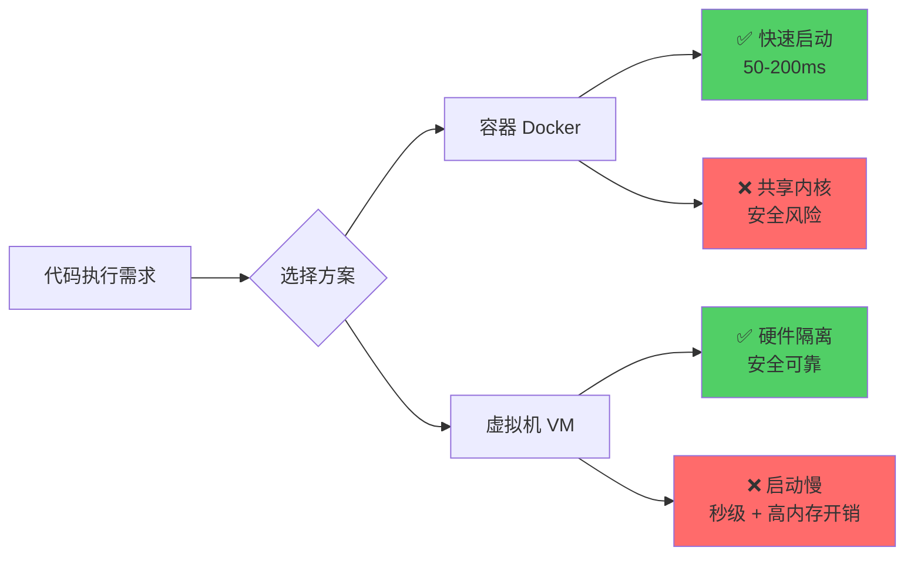

**核心矛盾**：安全性 vs 性能

---

## 2. OpenSandbox 是什么？

**OpenSandbox** 是阿里巴巴开源的通用沙箱平台，专为 AI 应用场景设计。

### 2.1 核心定位

```
OpenSandbox = 多语言 SDK + 开放协议 + 灵活运行时 + 强隔离
```

### 2.2 关键特性一览

| 维度 | 特性 | 说明 |
|------|------|------|
| **开源** | Apache 2.0 | 完全开源，可自托管 |
| **多语言** | Python/Java/TS/C#/Go | 5+ 语言 SDK |
| **运行时** | Docker + Kubernetes | 开发到生产平滑迁移 |
| **隔离** | gVisor/Kata/Firecracker | 多级安全容器支持 |
| **性能** | BatchSandbox | 吞吐量提升 80x+ |

### 2.3 应用场景

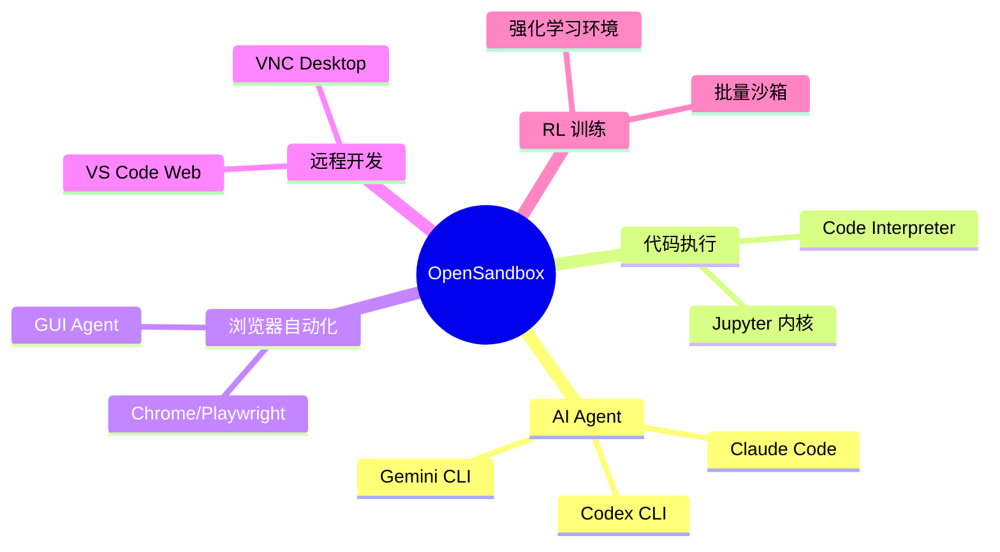

---

## 3. 架构全景图

### 3.1 四层架构总览

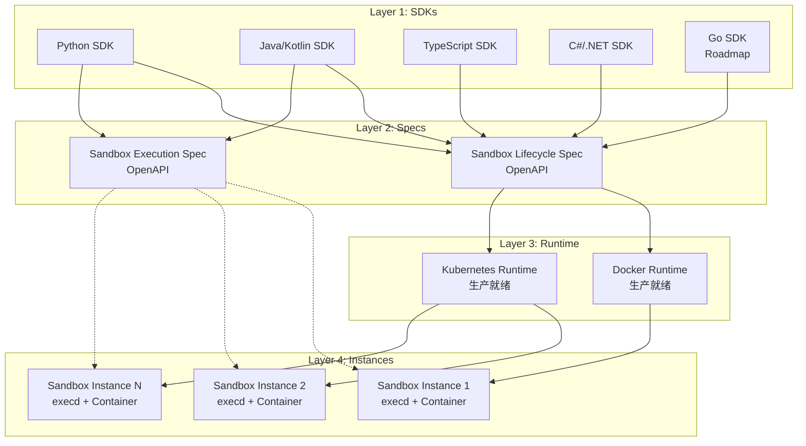

### 3.2 核心设计原则

| 原则 | 实现方式 | 收益 |
|------|----------|------|
| **协议优先** | OpenAPI 规范定义所有交互 | 可替换实现、多语言支持 |
| **关注点分离** | SDK/Specs/Runtime/execd 各司其职 | 独立演进、易于测试 |
| **可插拔运行时** | Docker/K8s/自定义运行时 | 灵活部署、平滑迁移 |
| **最小特权** | 可选 gVisor/Kata/Firecracker | 安全增强 |

---

## 4. 四层架构详解

### 4.1 SDKs 层：开发者体验

SDK 层提供高级抽象，封装所有沙箱操作：

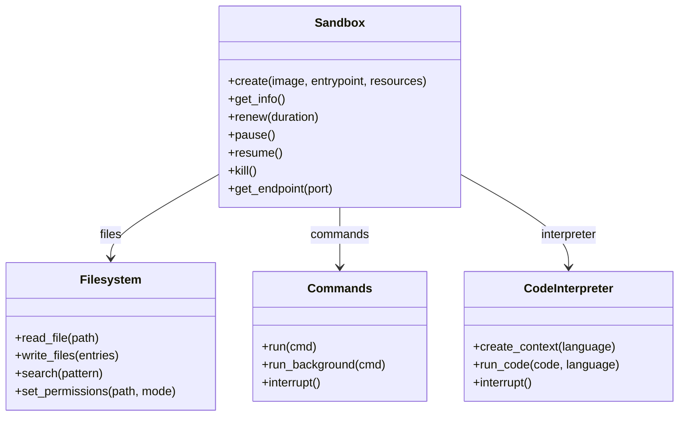

**关键特性：**
- 异步/同步 API 双模式
- 自动状态轮询
- 资源配额管理 (CPU/Memory/GPU)
- TTL 自动过期与续期

### 4.2 Specs 层：协议契约

两层 OpenAPI 规范定义了 SDK 与运行时的契约：

#### Lifecycle Spec 端点

```yaml
POST   /sandboxes              # 创建沙箱
GET    /sandboxes              # 列出沙箱
GET    /sandboxes/{id}         # 获取详情
DELETE /sandboxes/{id}         # 销毁沙箱
POST   /sandboxes/{id}/pause   # 暂停
POST   /sandboxes/{id}/resume  # 恢复
POST   /sandboxes/{id}/renew   # 续期
GET    /sandboxes/{id}/endpoints/{port}  # 获取端口地址
```

#### Execution Spec 端点

```yaml
# 代码执行
POST   /code/context           # 创建执行上下文
POST   /code                   # 执行代码 (SSE)
DELETE /code                   # 中断执行

# 命令执行
POST   /command                # 执行命令 (SSE)
DELETE /command                # 中断命令

# 文件操作
POST   /files/upload           # 上传文件
GET    /files/download         # 下载文件
GET    /files/search           # 搜索文件

# 监控
GET    /metrics                # 获取指标
GET    /metrics/watch          # 实时指标流 (SSE)
```

### 4.3 Runtime 层：编排引擎

#### Docker Runtime

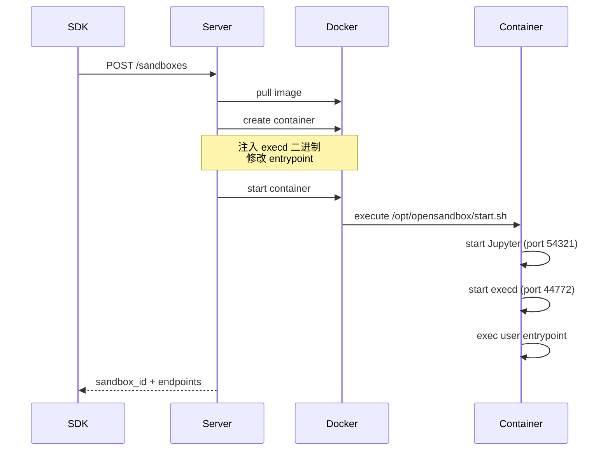

#### Kubernetes Runtime

**核心 CRDs：**

| CRD | 用途 | 关键特性 |
|-----|------|----------|
| **BatchSandbox** | 批量沙箱管理 | O(1) 批量创建、吞吐量 80x+ |
| **Pool** | 资源池预热 | 毫秒级沙箱获取 |
| **Task** | 任务编排 | 异构任务分发 |

**性能对比（100 沙箱创建）：**

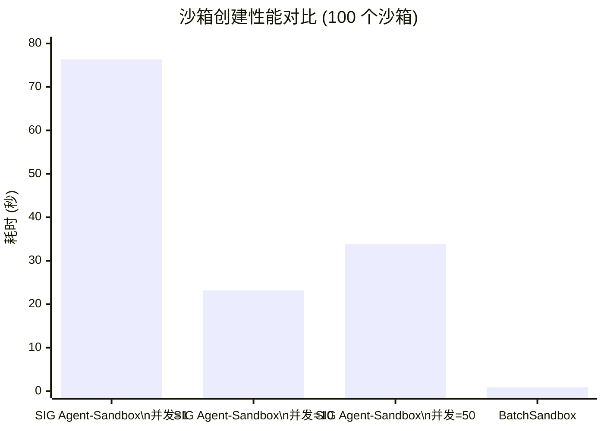

### 4.4 Instances 层：沙箱实例

每个沙箱实例的三层结构：

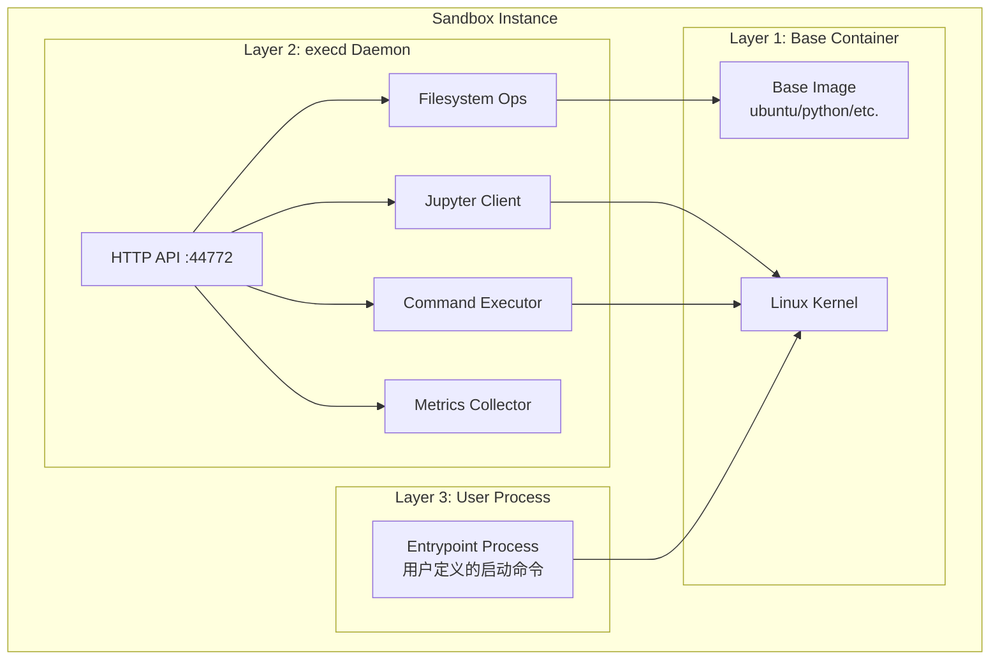

---

## 5. 核心组件深度剖析

### 5.1 execd - 执行守护进程

**位置**：`components/execd/`

execd 是注入到每个沙箱的高性能 Go 守护进程。

#### 架构设计

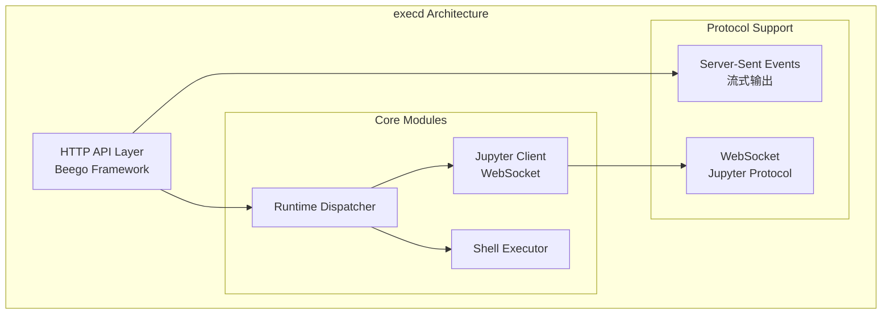

#### 技术栈

| 组件 | 技术 | 说明 |
|------|------|------|
| 语言 | Go 1.24+ | 高性能、低内存 |
| Web 框架 | Beego | 成熟的 Go Web 框架 |
| Jupyter | WebSocket Protocol | 实时双向通信 |
| 流式输出 | SSE | Server-Sent Events |
| 隔离 | 进程组 + 信号转发 | 安全的中断机制 |

#### 注入机制详解

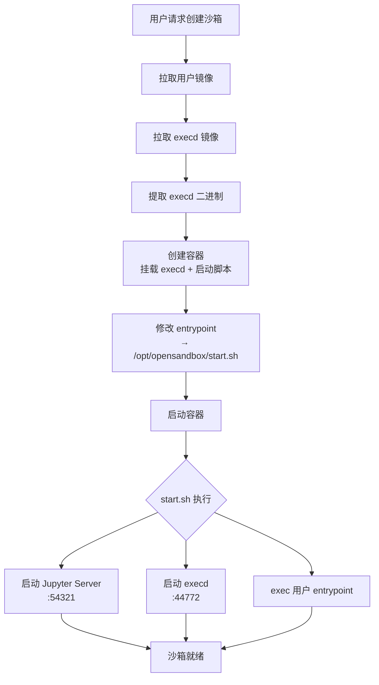

### 5.2 Egress Sidecar - 出口流量控制

**位置**：`components/egress/`

提供 FQDN 级别的出口流量控制。

#### 双层架构

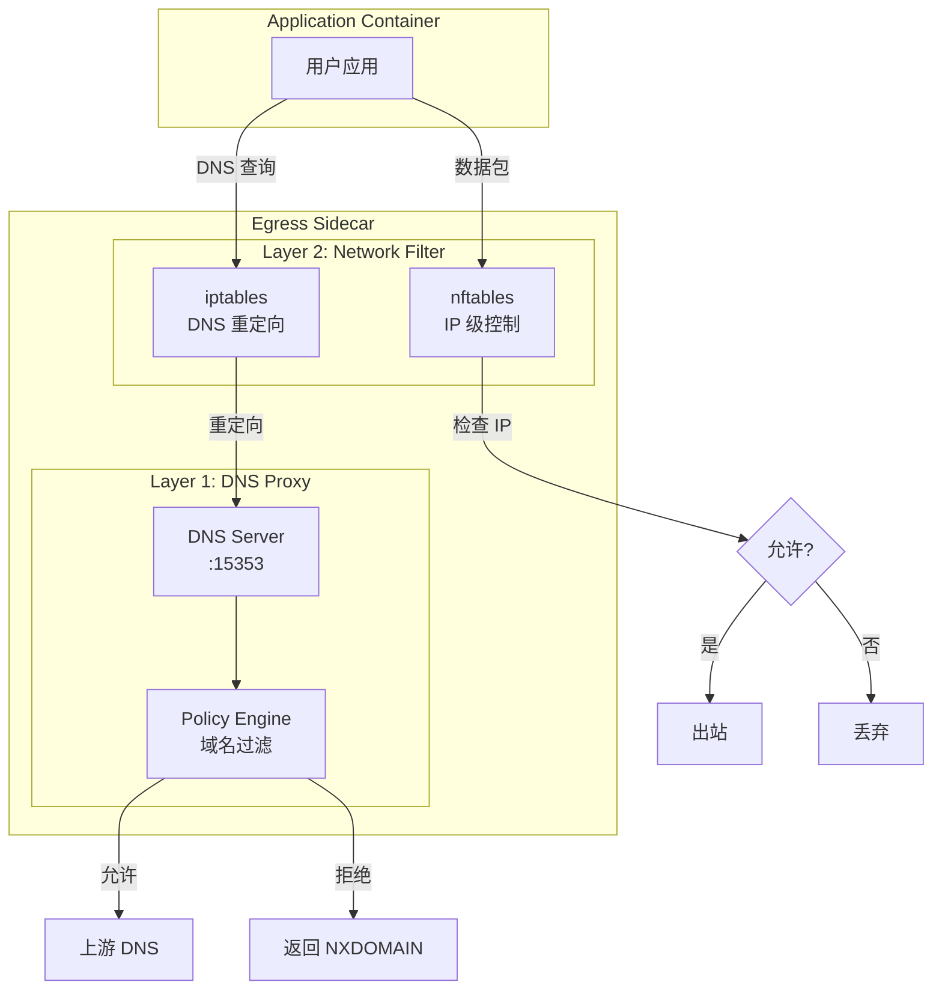

#### 运行时 API

```bash
# 设置白名单策略 (默认拒绝)
curl -XPOST http://localhost:18080/policy \
  -d '{"defaultAction":"deny","egress":[{"action":"allow","target":"*.github.com"}]}'

# 动态追加规则
curl -XPATCH http://localhost:18080/policy \
  -d '[{"action":"allow","target":"api.openai.com"}]'
```

### 5.3 Ingress - 入口流量路由

**位置**：`components/ingress/`

HTTP/WebSocket 反向代理，路由请求到沙箱实例。

#### 双模式路由

| 模式 | 格式 | 适用场景 |
|------|------|----------|
| **Header** | `OpenSandbox-Ingress-To: <id>-<port>` | API 调用、代理场景 |
| **URI** | `/<id>/<port>/<path>` | 浏览器访问、无 header 场景 |

---

## 6. 关键技术决策分析

### 6.1 为什么选择 Firecracker/gVisor/Kata？

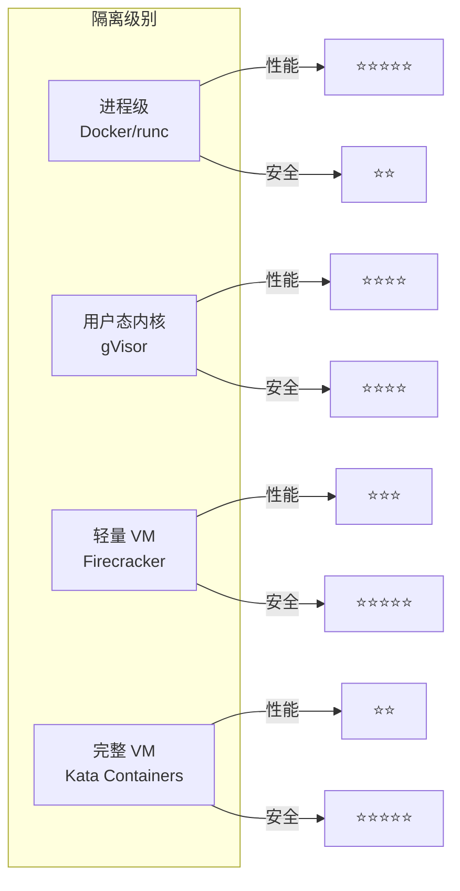

#### 技术对比

| 维度 | Docker/runc | gVisor | Firecracker | Kata |
|------|-------------|--------|-------------|------|
| **启动时间** | ~50ms | ~100ms | ~125ms | ~1s |
| **内存开销** | 共享内核 | ~50MB | ~5MB | ~128MB |
| **安全级别** | 进程隔离 | 系统调用过滤 | 硬件隔离 | 硬件隔离 |
| **兼容性** | ⭐⭐⭐⭐⭐ | ⭐⭐⭐⭐ | ⭐⭐⭐ | ⭐⭐⭐⭐ |
| **攻击面** | 大 | 中 | 小 | 小 |

### 6.2 为什么需要 execd 注入而非预构建镜像？

| 方案 | 优点 | 缺点 |
|------|------|------|
| **注入 execd** | 任意镜像可用、无需修改 | 启动时有注入开销 |
| **预构建镜像** | 启动最快 | 需要维护镜像变体、用户镜像需重建 |

**OpenSandbox 的选择**：开发阶段使用注入（灵活），生产环境推荐预构建镜像（性能）。

---

## 7. 性能与扩展性

### 7.1 BatchSandbox 的 O(1) 创建

传统方案 vs BatchSandbox：

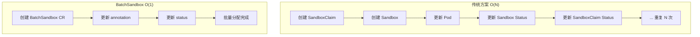

### 7.2 资源池预热机制

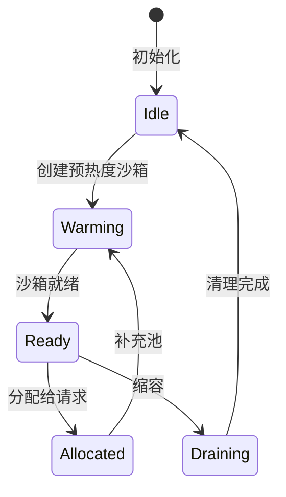

---

## 8. 安全隔离模型

### 8.1 多层防御架构

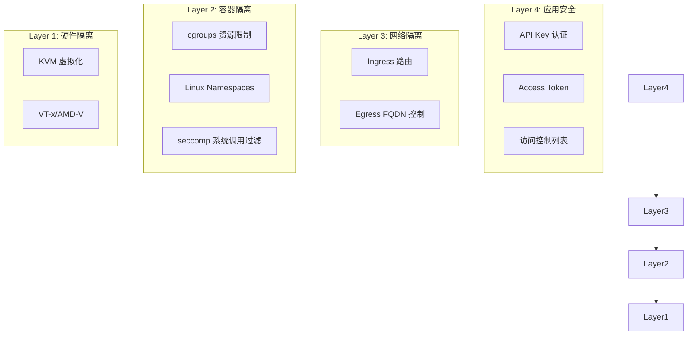

### 8.2 安全加固配置

```toml
[docker]
# 删除危险能力
drop_capabilities = ["AUDIT_WRITE", "MKNOD", "NET_ADMIN", "NET_RAW", "SYS_ADMIN"]

# 禁止权限提升
no_new_privileges = true

# 限制进程数 (防止 fork bomb)
pids_limit = 512

# AppArmor 配置文件
apparmor_profile = "docker-default"
```

---

## 9. 与其他方案对比

### 9.1 功能对比矩阵

| 特性 | OpenSandbox | E2B | Modal | Firecracker |
|------|:-----------:|:---:|:-----:|:-----------:|
| **开源** | ✅ | ❌ | ❌ | ✅ |
| **自托管** | ✅ | ❌ | ❌ | ✅ |
| **多语言 SDK** | ✅ 5+ | ✅ 2 | ✅ 1 | ❌ |
| **Kubernetes 原生** | ✅ | ❌ | ❌ | ⚠️ 需集成 |
| **安全容器支持** | ✅ 多种 | ✅ FC | ✅ gVisor | ✅ |
| **代码解释器** | ✅ 内置 | ✅ | ✅ | ❌ |
| **FQDN 网络控制** | ✅ | ⚠️ 有限 | ⚠️ 有限 | ❌ |
| **批量创建** | ✅ 80x | ⚠️ | ⚠️ | ❌ |

### 9.2 适用场景分析

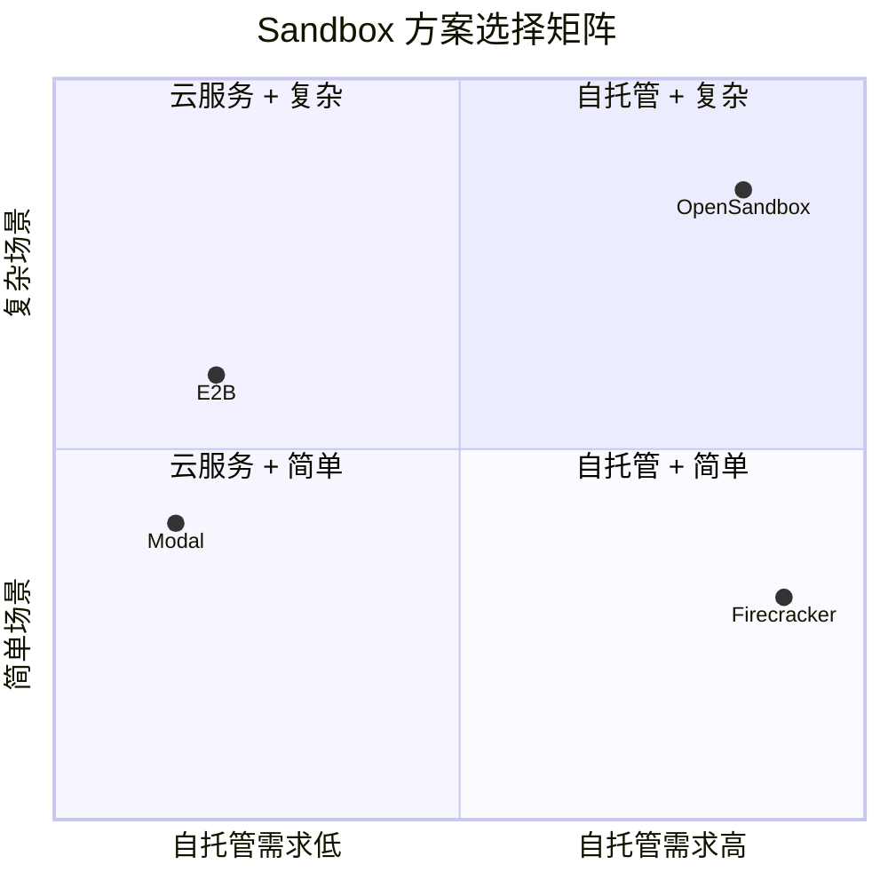

---

## 10. 建设性批判与建议

### 10.1 设计亮点 ✅

1. **协议开放**：OpenAPI 规范定义清晰，支持自定义实现
2. **架构分层**：四层分离，职责明确，独立演进
3. **性能优异**：BatchSandbox O(1) 创建，吞吐量 80x+
4. **生态丰富**：多语言 SDK、预置镜像、Agent 集成
5. **安全增强**：支持多种安全容器运行时

### 10.2 潜在问题与建议 ⚠️

| 问题 | 影响 | 建议 |
|------|------|------|
| **K8s 暂停/恢复未实现** | 部分生命周期 API 不可用 | 文档已说明，待后续版本 |
| **execd 注入开销** | 每次创建都有额外操作 | 生产环境使用预构建镜像 |
| **Egress 需要 CAP_NET_ADMIN** | 需要特权配置 | 评估安全策略，文档化风险 |
| **Go SDK 待发布** | Go 用户暂不可用 | 使用 Python/Java SDK 替代 |

### 10.3 生产环境建议 📋

1. **资源规划**：配置资源池预热，减少冷启动
2. **安全加固**：使用 gVisor/Kata/Firecracker
3. **网络策略**：配置 Egress 白名单
4. **监控告警**：集成 Prometheus/Grafana
5. **日志收集**：收集 execd 和 Server 日志

---

## 11. 参考资源

### 官方文档
- [OpenSandbox 文档](https://open-sandbox.ai/)
- [GitHub 仓库](https://github.com/alibaba/OpenSandbox)
- [Python SDK](https://pypi.org/project/opensandbox/)

### 技术论文
- [Firecracker: Lightweight Virtualization for Serverless Applications (NSDI '20)](https://www.usenix.org/conference/nsdi20/presentation/agache)

### 相关项目
- [E2B](https://e2b.dev/) - AI code execution platform
- [Firecracker](https://firecracker-microvm.github.io/) - MicroVM VMM
- [gVisor](https://gvisor.dev/) - Container runtime sandbox
- [Kata Containers](https://katacontainers.io/) - Secure container runtime

---

> **关于本文档**  
> 本分析基于 OpenSandbox GitHub 仓库源码和官方文档，旨在提供客观的技术评估。  
> 作者：sandboxrosy | 日期：2026-03-12

---

*最后更新：2026-03-12*