# OpenSandbox 架构深度分析 v3

> **作者**：sandboxrosy  
> **日期**：2026-03-12  
> **来源**：GitHub alibaba/OpenSandbox 源码分析  
> **阅读时间**：约 40 分钟  
> **版本**：v3.0 - 增强图表与深度分析版

---

## 📋 目录

1. [问题空间：AI 代码执行的挑战](#1-问题空间ai-代码执行的挑战)
2. [OpenSandbox 是什么？](#2-opensandbox-是什么)
3. [架构全景图](#3-架构全景图)
4. [四层架构详解](#4-四层架构详解)
5. [核心组件深度剖析](#5-核心组件深度剖析)
6. [通信流程详解](#6-通信流程详解)
7. [关键技术决策分析](#7-关键技术决策分析)
8. [性能与扩展性](#8-性能与扩展性)
9. [安全隔离模型](#9-安全隔离模型)
10. [部署架构](#10-部署架构)
11. [与其他方案对比](#11-与其他方案对比)
12. [建设性批判与建议](#12-建设性批判与建议)
13. [参考资源](#13-参考资源)

---

## 1. 问题空间：AI 代码执行的挑战

在深入架构之前，我们需要理解 OpenSandbox 要解决的问题。

### 1.1 AI Agent 的核心需求

AI 驱动的开发工具需要一个安全、快速的代码执行平台。与传统的开发工作流不同，AI Agent 有以下特殊需求：

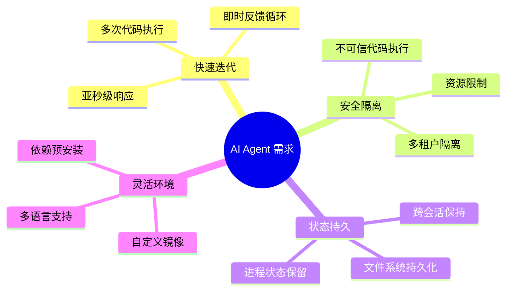
```mermaid
mindmap
  root((AI Agent 需求))
    快速迭代
      亚秒级响应
      即时反馈循环
      多次代码执行
    安全隔离
      不可信代码执行
      多租户隔离
      资源限制
    状态持久
      跨会话保持
      文件系统持久化
      进程状态保留
    灵活环境
      自定义镜像
      多语言支持
      依赖预安装
```

#### 需求对比表

| 需求维度 | 传统开发 | AI Agent | OpenSandbox 解决方案 |
|----------|----------|----------|----------------------|
| **迭代速度** | 秒级可接受 | 亚秒级必需 | 预热池 + 快速创建 |
| **代码来源** | 可信开发者 | 不可信 AI | 硬件级隔离 |
| **环境持久性** | 本地持久 | 跨会话保持 | TTL + 续期机制 |
| **多租户安全** | 单用户为主 | 企业级隔离 | 独立沙箱实例 |
| **资源控制** | 宿主机限制 | 精确配额 | cgroups + K8s limits |

### 1.2 现有方案的困境

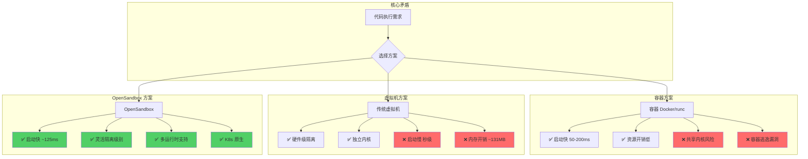
```mermaid
graph TB
    subgraph "核心矛盾"
        A[代码执行需求] --> B{选择方案}
    end
    
    subgraph "容器方案"
        B --> C[容器 Docker/runc]
        C --> C1[✅ 启动快 50-200ms]
        C --> C2[✅ 资源开销低]
        C --> C3[❌ 共享内核风险]
        C --> C4[❌ 容器逃逸漏洞]
    end
    
    subgraph "虚拟机方案"
        B --> D[传统虚拟机]
        D --> D1[✅ 硬件级隔离]
        D --> D2[✅ 独立内核]
        D --> D3[❌ 启动慢 秒级]
        D --> D4[❌ 内存开销 ~131MB]
    end
    
    subgraph "OpenSandbox 方案"
        B --> E[OpenSandbox]
        E --> E1[✅ 启动快 ~125ms]
        E --> E2[✅ 灵活隔离级别]
        E --> E3[✅ 多运行时支持]
        E --> E4[✅ K8s 原生]
    end
    
    style C3 fill:#ff6b6b
    style C4 fill:#ff6b6b
    style D3 fill:#ff6b6b
    style D4 fill:#ff6b6b
    style E1 fill:#51cf66
    style E2 fill:#51cf66
    style E3 fill:#51cf66
    style E4 fill:#51cf66
```

#### 安全漏洞案例分析

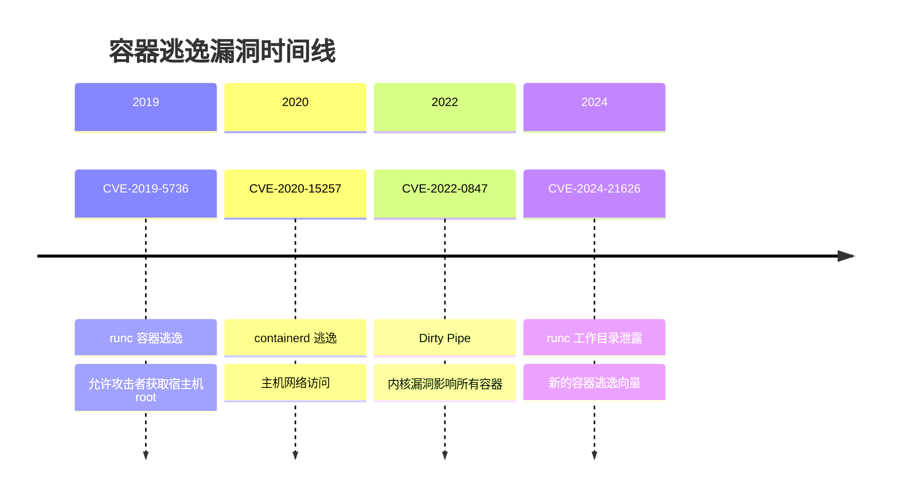
```mermaid
timeline
    title 容器逃逸漏洞时间线
    section 2019
        CVE-2019-5736 : runc 容器逃逸
                        : 允许攻击者获取宿主机 root
    section 2020
        CVE-2020-15257 : containerd 逃逸
                        : 主机网络访问
    section 2022
        CVE-2022-0847 : Dirty Pipe
                        : 内核漏洞影响所有容器
    section 2024
        CVE-2024-21626 : runc 工作目录泄露
                        : 新的容器逃逸向量
```

**结论**：共享内核的容器方案无法满足不可信代码执行的安全需求。

---

## 2. OpenSandbox 是什么？

**OpenSandbox** 是阿里巴巴开源的通用沙箱平台，专为 AI 应用场景设计。

### 2.1 核心定位

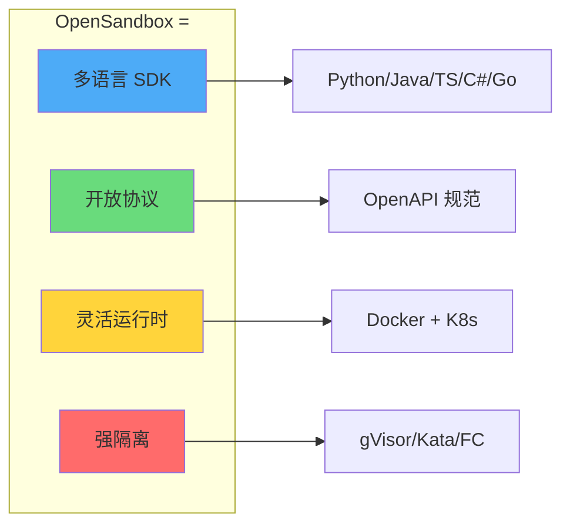
```mermaid
graph LR
    subgraph "OpenSandbox = "
        A[多语言 SDK]
        B[开放协议]
        C[灵活运行时]
        D[强隔离]
    end
    
    A --> E[Python/Java/TS/C#/Go]
    B --> F[OpenAPI 规范]
    C --> G[Docker + K8s]
    D --> H[gVisor/Kata/FC]
    
    style A fill:#4dabf7
    style B fill:#69db7c
    style C fill:#ffd43b
    style D fill:#ff6b6b
```

### 2.2 技术栈全景

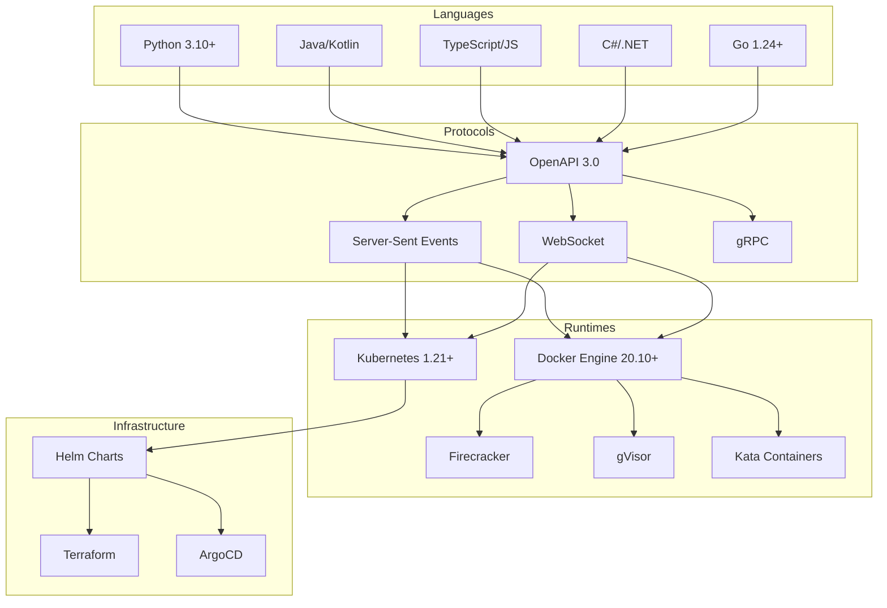
```mermaid
graph TB
    subgraph "Languages"
        PY[Python 3.10+]
        JAVA[Java/Kotlin]
        TS[TypeScript/JS]
        CS[C#/.NET]
        GO[Go 1.24+]
    end
    
    subgraph "Protocols"
        OAPI[OpenAPI 3.0]
        SSE[Server-Sent Events]
        WS[WebSocket]
        GRPC[gRPC]
    end
    
    subgraph "Runtimes"
        DOCKER[Docker Engine 20.10+]
        K8S[Kubernetes 1.21+]
        FC[Firecracker]
        GV[gVisor]
        KATA[Kata Containers]
    end
    
    subgraph "Infrastructure"
        HELM[Helm Charts]
        TERRA[Terraform]
        ARGO[ArgoCD]
    end
    
    PY & JAVA & TS & CS & GO --> OAPI
    OAPI --> SSE & WS & GRPC
    SSE & WS --> DOCKER & K8S
    DOCKER --> FC & GV & KATA
    K8S --> HELM
    HELM --> TERRA & ARGO
```

### 2.3 应用场景矩阵

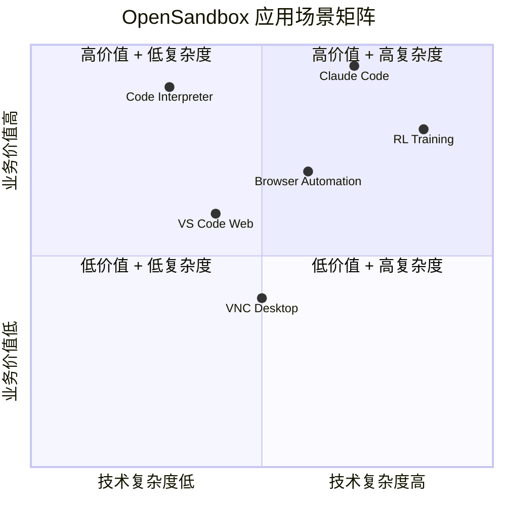
```mermaid
quadrantChart
    title OpenSandbox 应用场景矩阵
    x-axis 技术复杂度低 --> 技术复杂度高
    y-axis 业务价值低 --> 业务价值高
    quadrant-1 高价值 + 高复杂度
    quadrant-2 高价值 + 低复杂度
    quadrant-3 低价值 + 低复杂度
    quadrant-4 低价值 + 高复杂度
    
    Code Interpreter: [0.3, 0.9]
    Claude Code: [0.7, 0.95]
    Browser Automation: [0.6, 0.7]
    RL Training: [0.85, 0.8]
    VS Code Web: [0.4, 0.6]
    VNC Desktop: [0.5, 0.4]
```

---

## 3. 架构全景图

### 3.1 四层架构总览

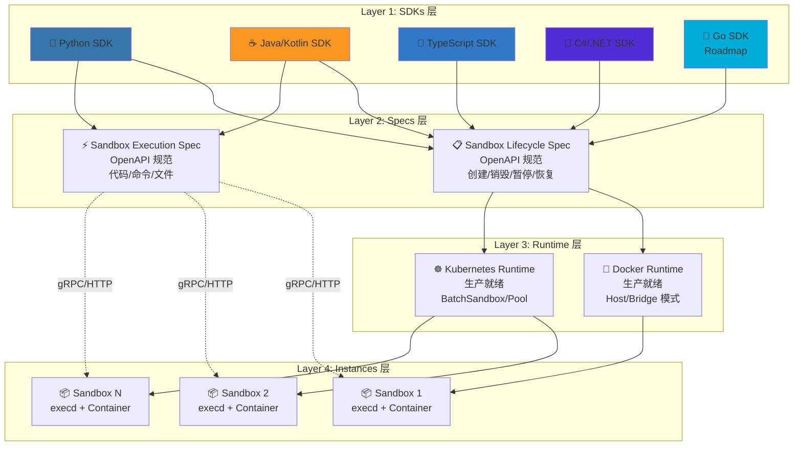
```mermaid
graph TB
    subgraph "Layer 1: SDKs 层"
        direction LR
        SDK_PY[🐍 Python SDK]
        SDK_JAVA[☕ Java/Kotlin SDK]
        SDK_TS[📘 TypeScript SDK]
        SDK_CS[💜 C#/.NET SDK]
        SDK_GO[🐹 Go SDK<br/>Roadmap]
    end
    
    subgraph "Layer 2: Specs 层"
        LIFECYCLE[📋 Sandbox Lifecycle Spec<br/>OpenAPI 规范<br/>创建/销毁/暂停/恢复]
        EXEC[⚡ Sandbox Execution Spec<br/>OpenAPI 规范<br/>代码/命令/文件]
    end
    
    subgraph "Layer 3: Runtime 层"
        DOCKER[🐳 Docker Runtime<br/>生产就绪<br/>Host/Bridge 模式]
        K8S[☸️ Kubernetes Runtime<br/>生产就绪<br/>BatchSandbox/Pool]
    end
    
    subgraph "Layer 4: Instances 层"
        direction LR
        SB1[📦 Sandbox 1<br/>execd + Container]
        SB2[📦 Sandbox 2<br/>execd + Container]
        SB3[📦 Sandbox N<br/>execd + Container]
    end
    
    SDK_PY & SDK_JAVA & SDK_TS & SDK_CS & SDK_GO --> LIFECYCLE
    SDK_PY & SDK_JAVA --> EXEC
    
    LIFECYCLE --> DOCKER & K8S
    EXEC -.->|gRPC/HTTP| SB1 & SB2 & SB3
    
    DOCKER --> SB1
    K8S --> SB2 & SB3
    
    style SDK_PY fill:#3776ab
    style SDK_JAVA fill:#f89820
    style SDK_TS fill:#3178c6
    style SDK_CS fill:#512bd4
    style SDK_GO fill:#00add8
```

### 3.2 组件交互全景图

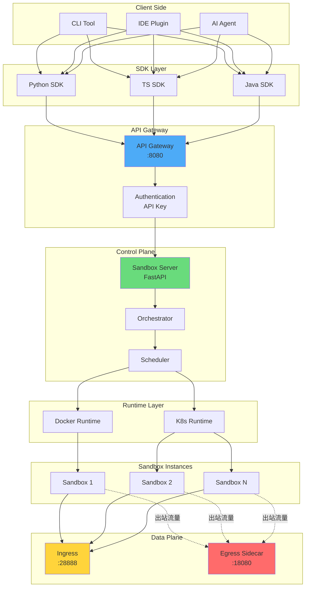
```mermaid
flowchart TB
    subgraph "Client Side"
        CLI[CLI Tool]
        IDE[IDE Plugin]
        AGENT[AI Agent]
    end
    
    subgraph "SDK Layer"
        PY_SDK[Python SDK]
        TS_SDK[TS SDK]
        JAVA_SDK[Java SDK]
    end
    
    subgraph "API Gateway"
        GW[API Gateway<br/>:8080]
        AUTH[Authentication<br/>API Key]
    end
    
    subgraph "Control Plane"
        SERVER[Sandbox Server<br/>FastAPI]
        ORCH[Orchestrator]
        SCHED[Scheduler]
    end
    
    subgraph "Runtime Layer"
        DOCKER_RT[Docker Runtime]
        K8S_RT[K8s Runtime]
    end
    
    subgraph "Data Plane"
        INGRESS[Ingress<br/>:28888]
        EGRESS[Egress Sidecar<br/>:18080]
    end
    
    subgraph "Sandbox Instances"
        SB1[Sandbox 1]
        SB2[Sandbox 2]
        SB3[Sandbox N]
    end
    
    CLI & IDE & AGENT --> PY_SDK & TS_SDK & JAVA_SDK
    PY_SDK & TS_SDK & JAVA_SDK --> GW
    GW --> AUTH --> SERVER
    SERVER --> ORCH --> SCHED
    SCHED --> DOCKER_RT & K8S_RT
    DOCKER_RT --> SB1
    K8S_RT --> SB2 & SB3
    
    SB1 & SB2 & SB3 --> INGRESS
    SB1 & SB2 & SB3 -.->|出站流量| EGRESS
    
    style GW fill:#4dabf7
    style SERVER fill:#69db7c
    style INGRESS fill:#ffd43b
    style EGRESS fill:#ff6b6b
```

### 3.3 核心设计原则

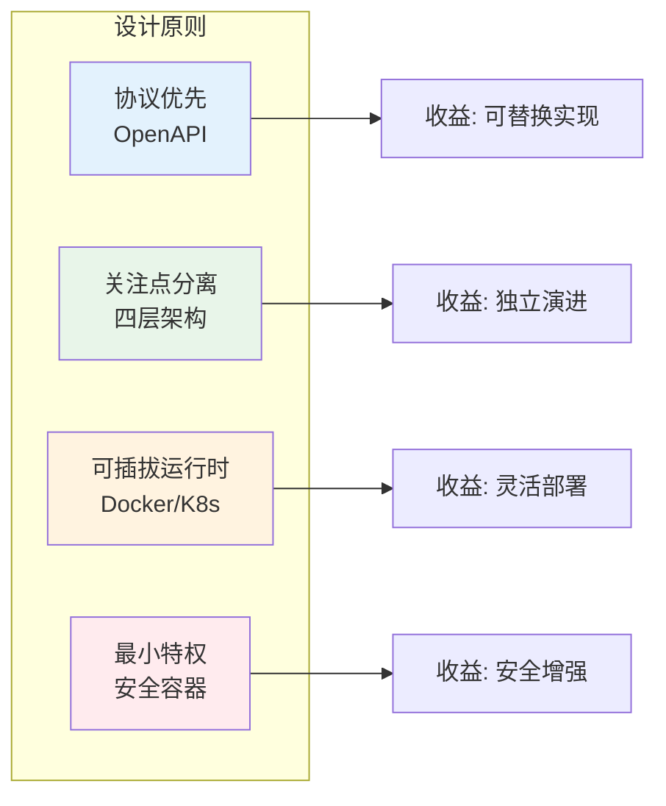
```mermaid
graph LR
    subgraph "设计原则"
        P1[协议优先<br/>OpenAPI]
        P2[关注点分离<br/>四层架构]
        P3[可插拔运行时<br/>Docker/K8s]
        P4[最小特权<br/>安全容器]
    end
    
    P1 --> B1[收益: 可替换实现]
    P2 --> B2[收益: 独立演进]
    P3 --> B3[收益: 灵活部署]
    P4 --> B4[收益: 安全增强]
    
    style P1 fill:#e3f2fd
    style P2 fill:#e8f5e9
    style P3 fill:#fff3e0
    style P4 fill:#ffebee
```

---

## 4. 四层架构详解

### 4.1 SDKs 层：开发者体验

#### SDK 类设计

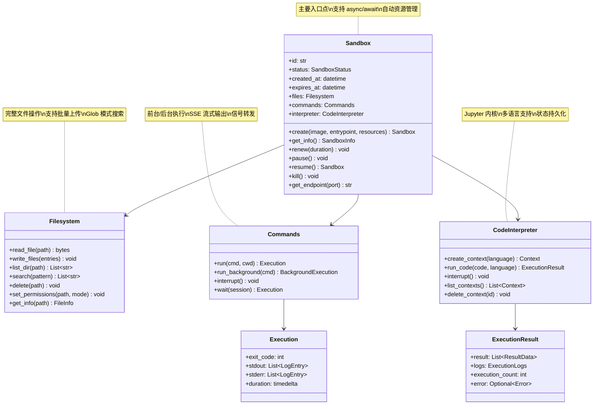
```mermaid
classDiagram
    class Sandbox {
        +id: str
        +status: SandboxStatus
        +created_at: datetime
        +expires_at: datetime
        
        +create(image, entrypoint, resources) Sandbox
        +get_info() SandboxInfo
        +renew(duration) void
        +pause() void
        +resume() Sandbox
        +kill() void
        +get_endpoint(port) str
        
        +files: Filesystem
        +commands: Commands
        +interpreter: CodeInterpreter
    }
    
    class Filesystem {
        +read_file(path) bytes
        +write_files(entries) void
        +list_dir(path) List~str~
        +search(pattern) List~str~
        +delete(path) void
        +set_permissions(path, mode) void
        +get_info(path) FileInfo
    }
    
    class Commands {
        +run(cmd, cwd) Execution
        +run_background(cmd) BackgroundExecution
        +interrupt() void
        +wait(session) Execution
    }
    
    class CodeInterpreter {
        +create_context(language) Context
        +run_code(code, language) ExecutionResult
        +interrupt() void
        +list_contexts() List~Context~
        +delete_context(id) void
    }
    
    class Execution {
        +exit_code: int
        +stdout: List~LogEntry~
        +stderr: List~LogEntry~
        +duration: timedelta
    }
    
    class ExecutionResult {
        +result: List~ResultData~
        +logs: ExecutionLogs
        +execution_count: int
        +error: Optional~Error~
    }
    
    Sandbox --> Filesystem
    Sandbox --> Commands
    Sandbox --> CodeInterpreter
    Commands --> Execution
    CodeInterpreter --> ExecutionResult
    
    note for Sandbox "主要入口点\n支持 async/await\n自动资源管理"
    note for Filesystem "完整文件操作\n支持批量上传\nGlob 模式搜索"
    note for Commands "前台/后台执行\nSSE 流式输出\n信号转发"
    note for CodeInterpreter "Jupyter 内核\n多语言支持\n状态持久化"
```

#### SDK 使用流程

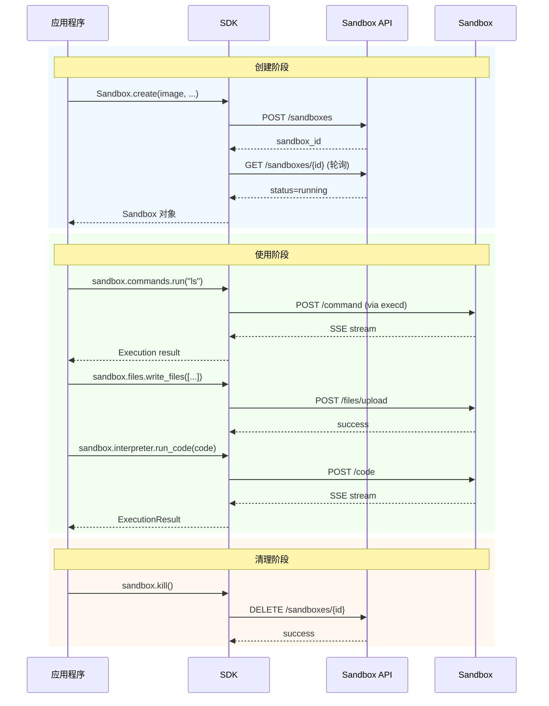
```mermaid
sequenceDiagram
    participant App as 应用程序
    participant SDK as SDK
    participant API as Sandbox API
    participant SB as Sandbox
    
    rect rgb(240, 248, 255)
        Note over App,SB: 创建阶段
        App->>SDK: Sandbox.create(image, ...)
        SDK->>API: POST /sandboxes
        API-->>SDK: sandbox_id
        SDK->>API: GET /sandboxes/{id} (轮询)
        API-->>SDK: status=running
        SDK-->>App: Sandbox 对象
    end
    
    rect rgb(240, 255, 240)
        Note over App,SB: 使用阶段
        App->>SDK: sandbox.commands.run("ls")
        SDK->>SB: POST /command (via execd)
        SB-->>SDK: SSE stream
        SDK-->>App: Execution result
        
        App->>SDK: sandbox.files.write_files([...])
        SDK->>SB: POST /files/upload
        SB-->>SDK: success
        
        App->>SDK: sandbox.interpreter.run_code(code)
        SDK->>SB: POST /code
        SB-->>SDK: SSE stream
        SDK-->>App: ExecutionResult
    end
    
    rect rgb(255, 248, 240)
        Note over App,SB: 清理阶段
        App->>SDK: sandbox.kill()
        SDK->>API: DELETE /sandboxes/{id}
        API-->>SDK: success
    end
```

### 4.2 Specs 层：协议契约

#### Lifecycle Spec 端点详解

```mermaid
graph TB
    subgraph "Sandbox Lifecycle API"
        CREATE[POST /sandboxes<br/>创建沙箱]
        LIST[GET /sandboxes<br/>列出沙箱]
        GET[GET /sandboxes/{id}<br/>获取详情]
        DELETE[DELETE /sandboxes/{id}<br/>销毁沙箱]
        PAUSE[POST /sandboxes/{id}/pause<br/>暂停沙箱]
        RESUME[POST /sandboxes/{id}/resume<br/>恢复沙箱]
        RENEW[POST /sandboxes/{id}/renew<br/>续期]
        ENDPOINT[GET /sandboxes/{id}/endpoints/{port}<br/>获取端口地址]
    end
    
    subgraph "Request Schema"
        REQ_CREATE["{<br/>  image: 'ubuntu:22.04',<br/>  entrypoint: ['python'],<br/>  resources: { cpu: '1', memory: '512Mi' },<br/>  timeout: '30m'<br/>}"]
    end
    
    subgraph "Response Schema"
        RES_CREATE["{<br/>  sandbox_id: 'sb_xxx',<br/>  status: 'pending',<br/>  created_at: '...'<br/>}"]
    end
    
    REQ_CREATE --> CREATE
    CREATE --> RES_CREATE
    
    style CREATE fill:#51cf66
    style DELETE fill:#ff6b6b
    style PAUSE fill:#ffd43b
    style RESUME fill:#4dabf7
```

#### Execution Spec 端点详解

```mermaid
graph TB
    subgraph "Code Execution API"
        CODE_CTX[POST /code/context<br/>创建执行上下文]
        CODE_RUN[POST /code<br/>执行代码 SSE]
        CODE_INT[DELETE /code<br/>中断执行]
        CODE_LIST[GET /code/contexts<br/>列出上下文]
        CODE_DEL[DELETE /code/contexts/{id}<br/>删除上下文]
    end
    
    subgraph "Command Execution API"
        CMD_RUN[POST /command<br/>执行命令 SSE]
        CMD_INT[DELETE /command<br/>中断命令]
        CMD_STATUS[GET /command/status/{session}<br/>获取状态]
        CMD_OUTPUT[GET /command/output/{session}<br/>获取输出]
    end
    
    subgraph "Filesystem API"
        FILE_INFO[GET /files/info<br/>文件信息]
        FILE_UPLOAD[POST /files/upload<br/>上传文件]
        FILE_DOWNLOAD[GET /files/download<br/>下载文件]
        FILE_SEARCH[GET /files/search<br/>搜索文件]
        FILE_DELETE[DELETE /files<br/>删除文件]
        FILE_MV[POST /files/mv<br/>移动文件]
        DIR_CREATE[POST /directories<br/>创建目录]
        DIR_DELETE[DELETE /directories<br/>删除目录]
    end
    
    subgraph "Metrics API"
        METRICS[GET /metrics<br/>获取指标]
        METRICS_WATCH[GET /metrics/watch<br/>实时监控 SSE]
    end
    
    style CODE_RUN fill:#51cf66
    style CMD_RUN fill:#4dabf7
    style FILE_UPLOAD fill:#ffd43b
    style METRICS_WATCH fill:#ff6b6b
```

### 4.3 Runtime 层：编排引擎

#### Docker Runtime 详细流程

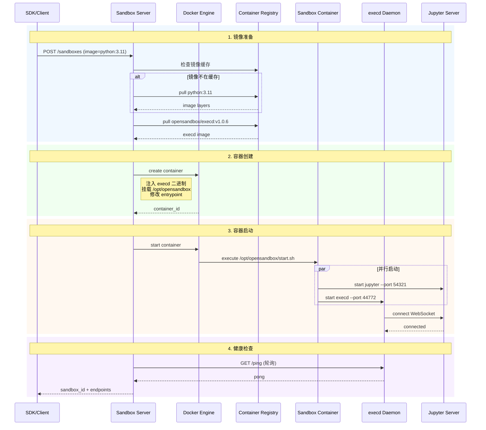
```mermaid
sequenceDiagram
    participant SDK as SDK/Client
    participant Server as Sandbox Server
    participant Docker as Docker Engine
    participant Registry as Container Registry
    participant Container as Sandbox Container
    participant Execd as execd Daemon
    participant Jupyter as Jupyter Server
    
    rect rgb(240, 248, 255)
        Note over SDK,Jupyter: 1. 镜像准备
        SDK->>Server: POST /sandboxes (image=python:3.11)
        Server->>Registry: 检查镜像缓存
        alt 镜像不在缓存
            Server->>Registry: pull python:3.11
            Registry-->>Server: image layers
        end
        Server->>Registry: pull opensandbox/execd:v1.0.6
        Registry-->>Server: execd image
    end
    
    rect rgb(240, 255, 240)
        Note over SDK,Jupyter: 2. 容器创建
        Server->>Docker: create container
        Note right of Server: 注入 execd 二进制<br/>挂载 /opt/opensandbox<br/>修改 entrypoint
        Docker-->>Server: container_id
    end
    
    rect rgb(255, 248, 240)
        Note over SDK,Jupyter: 3. 容器启动
        Server->>Docker: start container
        Docker->>Container: execute /opt/opensandbox/start.sh
        
        par 并行启动
            Container->>Jupyter: start jupyter --port 54321
            Container->>Execd: start execd --port 44772
        end
        
        Execd->>Jupyter: connect WebSocket
        Jupyter-->>Execd: connected
    end
    
    rect rgb(248, 240, 255)
        Note over SDK,Jupyter: 4. 健康检查
        Server->>Execd: GET /ping (轮询)
        Execd-->>Server: pong
        Server-->>SDK: sandbox_id + endpoints
    end
```

#### Kubernetes Runtime 架构

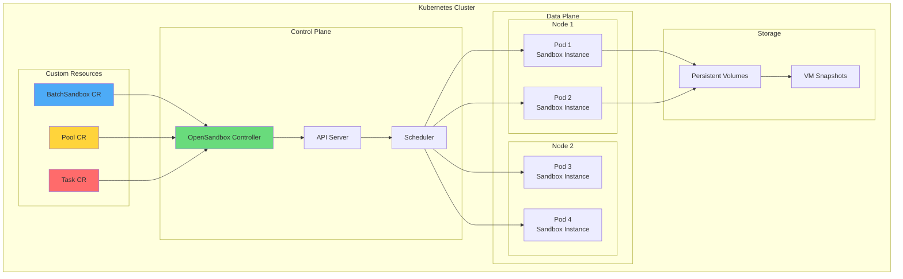
```mermaid
graph TB
    subgraph "Kubernetes Cluster"
        subgraph "Control Plane"
            API_SERVER[API Server]
            CTRL[OpenSandbox Controller]
            SCHED[Scheduler]
        end
        
        subgraph "Custom Resources"
            BS[BatchSandbox CR]
            POOL[Pool CR]
            TASK[Task CR]
        end
        
        subgraph "Data Plane"
            subgraph "Node 1"
                POD1[Pod 1<br/>Sandbox Instance]
                POD2[Pod 2<br/>Sandbox Instance]
            end
            subgraph "Node 2"
                POD3[Pod 3<br/>Sandbox Instance]
                POD4[Pod 4<br/>Sandbox Instance]
            end
        end
        
        subgraph "Storage"
            PV[Persistent Volumes]
            SNAP[VM Snapshots]
        end
    end
    
    BS --> CTRL
    POOL --> CTRL
    TASK --> CTRL
    
    CTRL --> API_SERVER
    API_SERVER --> SCHED
    SCHED --> POD1 & POD2 & POD3 & POD4
    
    POD1 & POD2 --> PV
    PV --> SNAP
    
    style CTRL fill:#69db7c
    style BS fill:#4dabf7
    style POOL fill:#ffd43b
    style TASK fill:#ff6b6b
```

### 4.4 Instances 层：沙箱实例

#### 沙箱实例内部结构

```mermaid
graph TB
    subgraph "Sandbox Instance"
        subgraph "Network Namespace"
            NET_NS[Network Namespace<br/>隔离网络栈]
        end
        
        subgraph "Mount Namespace"
            ROOTFS[Root Filesystem<br/>容器镜像]
            WORKDIR[Working Directory<br/>用户工作区]
            OPT[/opt/opensandbox<br/>execd 注入目录]
        end
        
        subgraph "Process Namespace"
            INIT[PID 1: start.sh]
            EXECD[execd :44772]
            JUPYTER[jupyter :54321]
            USER_PROC[User Process]
        end
        
        subgraph "IPC Namespace"
            SHM[Shared Memory]
            SEMAPHORES[Semaphores]
        end
    end
    
    INIT --> EXECD & JUPYTER & USER_PROC
    EXECD --> JUPYTER
    EXECD --> ROOTFS & WORKDIR
    USER_PROC --> ROOTFS & WORKDIR
    
    style NET_NS fill:#e3f2fd
    style ROOTFS fill:#e8f5e9
    style EXECD fill:#fff3e0
    style USER_PROC fill:#ffebee
```

---

## 5. 核心组件深度剖析

### 5.1 execd - 执行守护进程

#### execd 完整架构

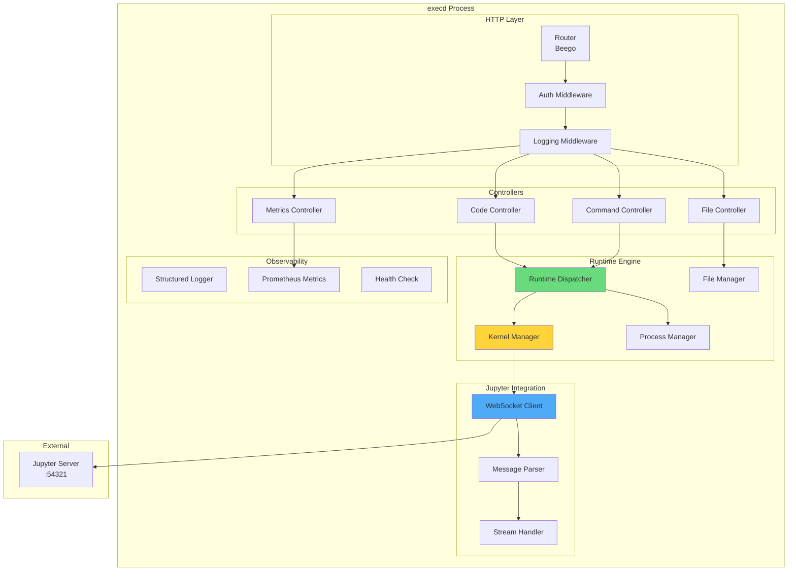
```mermaid
graph TB
    subgraph "execd Process"
        subgraph "HTTP Layer"
            ROUTER[Router<br/>Beego]
            AUTH_MW[Auth Middleware]
            LOG_MW[Logging Middleware]
        end
        
        subgraph "Controllers"
            CODE_CTRL[Code Controller]
            CMD_CTRL[Command Controller]
            FILE_CTRL[File Controller]
            METRICS_CTRL[Metrics Controller]
        end
        
        subgraph "Runtime Engine"
            DISPATCHER[Runtime Dispatcher]
            KERNEL_MGR[Kernel Manager]
            PROC_MGR[Process Manager]
            FILE_MGR[File Manager]
        end
        
        subgraph "Jupyter Integration"
            WS_CLIENT[WebSocket Client]
            MSG_PARSER[Message Parser]
            STREAM_HANDLER[Stream Handler]
        end
        
        subgraph "Observability"
            LOGGER[Structured Logger]
            METRICS[Prometheus Metrics]
            HEALTH[Health Check]
        end
    end
    
    subgraph "External"
        JUPYTER_SVR[Jupyter Server<br/>:54321]
    end
    
    ROUTER --> AUTH_MW --> LOG_MW
    LOG_MW --> CODE_CTRL & CMD_CTRL & FILE_CTRL & METRICS_CTRL
    
    CODE_CTRL --> DISPATCHER --> KERNEL_MGR --> WS_CLIENT
    CMD_CTRL --> DISPATCHER --> PROC_MGR
    FILE_CTRL --> FILE_MGR
    METRICS_CTRL --> METRICS
    
    WS_CLIENT --> MSG_PARSER --> STREAM_HANDLER
    WS_CLIENT --> JUPYTER_SVR
    
    style DISPATCHER fill:#69db7c
    style WS_CLIENT fill:#4dabf7
    style KERNEL_MGR fill:#ffd43b
```

#### 代码执行流程

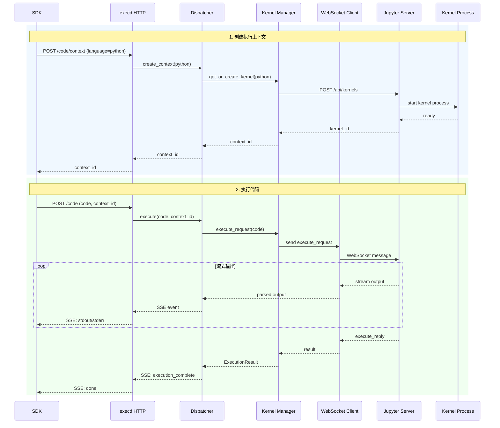
```mermaid
sequenceDiagram
    participant SDK as SDK
    participant HTTP as execd HTTP
    participant Dispatch as Dispatcher
    participant Kernel as Kernel Manager
    participant WS as WebSocket Client
    participant Jupyter as Jupyter Server
    participant KernelProc as Kernel Process
    
    rect rgb(240, 248, 255)
        Note over SDK,KernelProc: 1. 创建执行上下文
        SDK->>HTTP: POST /code/context (language=python)
        HTTP->>Dispatch: create_context(python)
        Dispatch->>Kernel: get_or_create_kernel(python)
        Kernel->>Jupyter: POST /api/kernels
        Jupyter->>KernelProc: start kernel process
        KernelProc-->>Jupyter: ready
        Jupyter-->>Kernel: kernel_id
        Kernel-->>Dispatch: context_id
        Dispatch-->>HTTP: context_id
        HTTP-->>SDK: context_id
    end
    
    rect rgb(240, 255, 240)
        Note over SDK,KernelProc: 2. 执行代码
        SDK->>HTTP: POST /code (code, context_id)
        HTTP->>Dispatch: execute(code, context_id)
        Dispatch->>Kernel: execute_request(code)
        Kernel->>WS: send execute_request
        WS->>Jupyter: WebSocket message
        
        loop 流式输出
            Jupyter-->>WS: stream output
            WS-->>Dispatch: parsed output
            Dispatch-->>HTTP: SSE event
            HTTP-->>SDK: SSE: stdout/stderr
        end
        
        Jupyter-->>WS: execute_reply
        WS-->>Kernel: result
        Kernel-->>Dispatch: ExecutionResult
        Dispatch-->>HTTP: SSE: execution_complete
        HTTP-->>SDK: SSE: done
    end
```

### 5.2 Egress Sidecar - 出口流量控制

#### Egress 完整架构

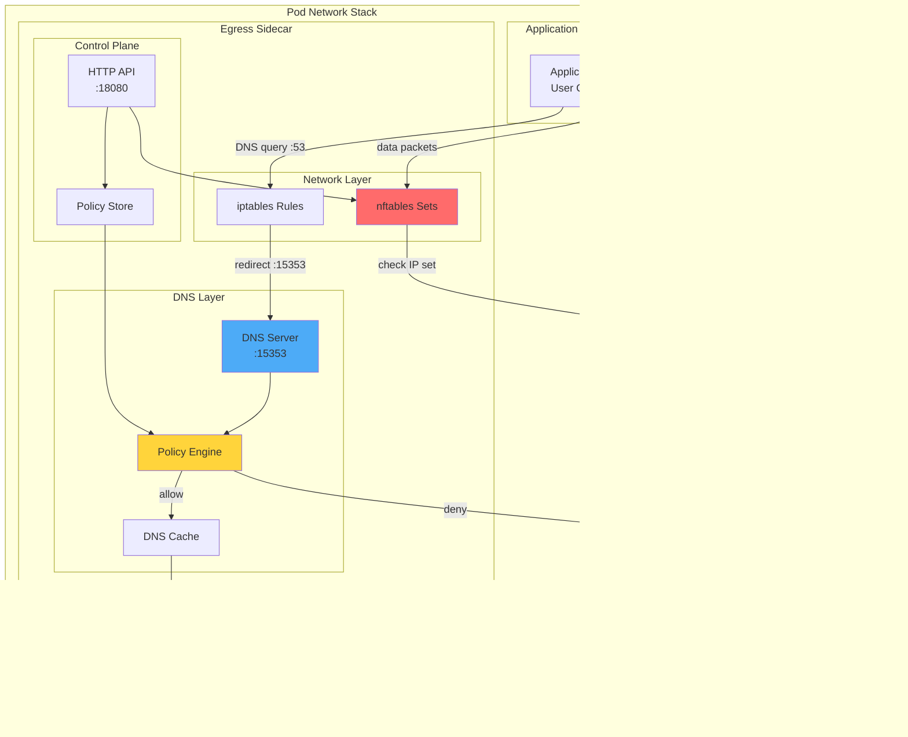
```mermaid
graph TB
    subgraph "Pod Network Stack"
        subgraph "Application Container"
            APP[Application<br/>User Code]
        end
        
        subgraph "Egress Sidecar"
            subgraph "DNS Layer"
                DNS_SVR[DNS Server<br/>:15353]
                POLICY[Policy Engine]
                CACHE[DNS Cache]
            end
            
            subgraph "Network Layer"
                IPT[iptables Rules]
                NFT[nftables Sets]
            end
            
            subgraph "Control Plane"
                HTTP_API[HTTP API<br/>:18080]
                POLICY_STORE[Policy Store]
            end
        end
    end
    
    subgraph "External"
        UPSTREAM[Upstream DNS<br/>8.8.8.8]
        INTERNET[Internet]
    end
    
    APP -->|DNS query :53| IPT
    IPT -->|redirect :15353| DNS_SVR
    DNS_SVR --> POLICY
    POLICY -->|allow| CACHE --> UPSTREAM
    POLICY -->|deny| NXDOMAIN[return NXDOMAIN]
    
    APP -->|data packets| NFT
    NFT -->|check IP set| DECISION{Allowed?}
    DECISION -->|yes| INTERNET
    DECISION -->|no| DROP[Drop]
    
    HTTP_API --> POLICY_STORE --> POLICY
    HTTP_API --> NFT
    
    style DNS_SVR fill:#4dabf7
    style NFT fill:#ff6b6b
    style POLICY fill:#ffd43b
```

#### FQDN 控制流程

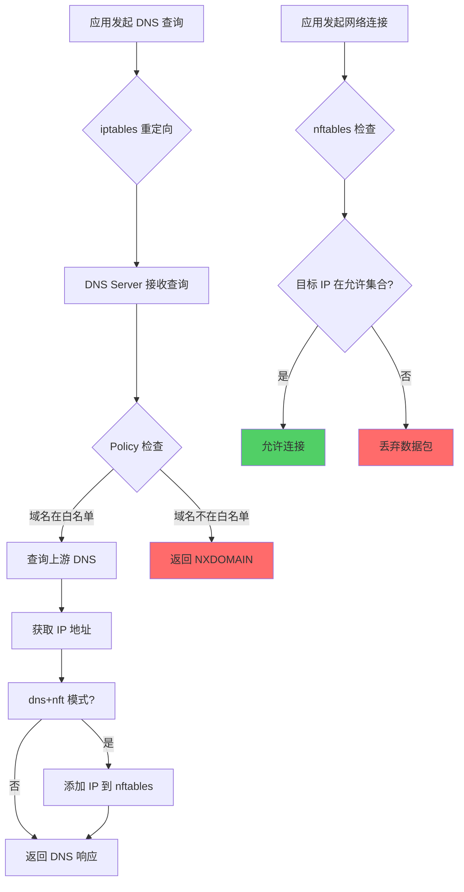
```mermaid
flowchart TD
    A[应用发起 DNS 查询] --> B{iptables 重定向}
    B --> C[DNS Server 接收查询]
    C --> D{Policy 检查}
    
    D -->|域名在白名单| E[查询上游 DNS]
    D -->|域名不在白名单| F[返回 NXDOMAIN]
    
    E --> G[获取 IP 地址]
    G --> H[dns+nft 模式?]
    
    H -->|是| I[添加 IP 到 nftables]
    H -->|否| J[返回 DNS 响应]
    
    I --> J
    
    K[应用发起网络连接] --> L{nftables 检查}
    L --> M{目标 IP 在允许集合?}
    M -->|是| N[允许连接]
    M -->|否| O[丢弃数据包]
    
    style F fill:#ff6b6b
    style O fill:#ff6b6b
    style N fill:#51cf66
```

### 5.3 Ingress - 入口流量路由

#### Ingress 路由机制

```mermaid
sequenceDiagram
    participant Client as Client
    participant LB as Load Balancer
    participant Ingress as Ingress
    participant K8s as K8s API
    participant SB as Sandbox Pod
    
    rect rgb(240, 248, 255)
        Note over Client,SB: Header Mode
        Client->>LB: GET /api/users<br/>Header: OpenSandbox-Ingress-To: sb-123-8080
        LB->>Ingress: forward
        Ingress->>Ingress: extract sandbox_id=sb-123, port=8080
        Ingress->>K8s: GET BatchSandbox sb-123
        K8s-->>Ingress: endpoints annotation
        Ingress->>SB: GET /api/users
        SB-->>Ingress: response
        Ingress-->>Client: response
    end
    
    rect rgb(240, 255, 240)
        Note over Client,SB: URI Mode
        Client->>LB: GET /sb-123/8080/api/users
        LB->>Ingress: forward
        Ingress->>Ingress: parse URI: sandbox=sb-123, port=8080
        Ingress->>K8s: GET BatchSandbox sb-123
        K8s-->>Ingress: endpoints annotation
        Ingress->>SB: GET /api/users
        SB-->>Ingress: response
        Ingress-->>Client: response
    end
```

---

## 6. 通信流程详解

### 6.1 沙箱创建完整流程

```mermaid
sequenceDiagram
    participant User as 用户/Agent
    participant SDK as SDK
    participant API as Sandbox API
    participant Orch as Orchestrator
    participant Runtime as Runtime<br/>(Docker/K8s)
    participant Container as Container
    participant Execd as execd
    
    User->>SDK: sandbox = Sandbox.create(image, ...)
    SDK->>API: POST /v1/sandboxes
    Note right of SDK: {<br/>  image: "python:3.11",<br/>  entrypoint: ["python"],<br/>  resources: {cpu: "1", memory: "512Mi"},<br/>  timeout: "30m"<br/>}
    
    API->>Orch: create_sandbox(request)
    Orch->>Orch: validate_request()
    Orch->>Runtime: create_instance()
    
    Runtime->>Runtime: pull_image()
    Runtime->>Runtime: inject_execd_binary()
    Runtime->>Container: create_container()
    Runtime->>Container: start_container()
    
    Container->>Execd: start execd :44772
    Execd->>Execd: initialize()
    Execd-->>Container: ready
    
    Runtime-->>Orch: instance_created
    Orch-->>API: sandbox_id
    API-->>SDK: {sandbox_id, status: "pending"}
    
    loop 健康检查 (最多 60s)
        SDK->>API: GET /v1/sandboxes/{id}
        API->>Execd: GET /ping
        alt not ready
            Execd-->>API: timeout
            API-->>SDK: {status: "pending"}
        else ready
            Execd-->>API: pong
            API-->>SDK: {status: "running", endpoints: {...}}
        end
    end
    
    SDK-->>User: Sandbox object (ready)
```

### 6.2 代码执行详细流程

```mermaid
sequenceDiagram
    participant User as 用户
    participant SDK as CodeInterpreter SDK
    participant Execd as execd API
    participant Kernel as Kernel Manager
    participant Jupyter as Jupyter Server
    participant Proc as Kernel Process
    
    User->>SDK: interpreter.run_code(code, language)
    
    alt 无活跃上下文
        SDK->>Execd: POST /code/context (language)
        Execd->>Kernel: create_kernel(language)
        Kernel->>Jupyter: POST /api/kernels
        Jupyter->>Proc: start kernel process
        Proc-->>Jupyter: ready
        Jupyter-->>Kernel: kernel_id
        Kernel-->>Execd: context_id
        Execd-->>SDK: context_id
    end
    
    SDK->>Execd: POST /code (code, context_id)<br/>Accept: text/event-stream
    Execd->>Kernel: execute_request(code)
    Kernel->>Jupyter: WebSocket execute_request
    
    par 流式输出处理
        Jupyter-->>Kernel: stream: stdout
        Kernel-->>Execd: parse -> SSE event
        Execd-->>SDK: SSE: stdout event
        
        Jupyter-->>Kernel: stream: stderr
        Kernel-->>Execd: parse -> SSE event
        Execd-->>SDK: SSE: stderr event
    end
    
    Jupyter-->>Kernel: execute_reply
    Kernel-->>Execd: ExecutionResult
    Execd-->>SDK: SSE: execution_complete
    
    SDK->>SDK: parse SSE events
    SDK-->>User: ExecutionResult {<br/>  result: [...],<br/>  stdout: [...],<br/>  stderr: [...],<br/>  error: null<br/>}
```

### 6.3 文件操作流程

```mermaid
sequenceDiagram
    participant SDK as SDK
    participant Execd as execd
    participant FS as Filesystem
    participant Disk as Disk
    
    rect rgb(240, 248, 255)
        Note over SDK,Disk: 上传文件
        SDK->>Execd: POST /files/upload (multipart)
        Note right of SDK: files: [<br/>  {path: "/app/main.py", data: "..."},<br/>  {path: "/app/utils.py", data: "..."}<br/>]
        
        loop 每个文件
            Execd->>FS: write_file(path, data)
            FS->>Disk: write to disk
        end
        
        Execd-->>SDK: {success: true, files: [...]}
    end
    
    rect rgb(240, 255, 240)
        Note over SDK,Disk: 下载文件
        SDK->>Execd: GET /files/download?path=/app/output.json
        Execd->>FS: read_file(path)
        FS->>Disk: read from disk
        Disk-->>FS: file content
        FS-->>Execd: content
        Execd-->>SDK: file content (stream)
    end
    
    rect rgb(255, 248, 240)
        Note over SDK,Disk: 搜索文件
        SDK->>Execd: GET /files/search?pattern=**/*.py
        Execd->>FS: glob_search(pattern)
        FS->>Disk: walk directory
        Disk-->>FS: matching files
        FS-->>Execd: file list
        Execd-->>SDK: {files: ["/app/main.py", "/app/utils.py"]}
    end
```

---

## 7. 关键技术决策分析

### 7.1 隔离方案选择

#### 安全容器运行时对比

```mermaid
graph TB
    subgraph "隔离级别递进"
        L1[runc<br/>进程级隔离]
        L2[gVisor<br/>用户态内核]
        L3[Firecracker<br/>MicroVM]
        L4[Kata Containers<br/>完整 VM]
    end
    
    subgraph "性能指标"
        P1[启动: ~50ms<br/>内存: 共享内核<br/>兼容: ⭐⭐⭐⭐⭐]
        P2[启动: ~100ms<br/>内存: ~50MB<br/>兼容: ⭐⭐⭐⭐]
        P3[启动: ~125ms<br/>内存: ~5MB<br/>兼容: ⭐⭐⭐]
        P4[启动: ~1s<br/>内存: ~128MB<br/>兼容: ⭐⭐⭐⭐]
    end
    
    subgraph "安全指标"
        S1[安全: ⭐⭐<br/>攻击面: 大<br/>隔离: 内核共享]
        S2[安全: ⭐⭐⭐⭐<br/>攻击面: 中<br/>隔离: 系统调用过滤]
        S3[安全: ⭐⭐⭐⭐⭐<br/>攻击面: 小<br/>隔离: 硬件级]
        S4[安全: ⭐⭐⭐⭐⭐<br/>攻击面: 小<br/>隔离: 硬件级]
    end
    
    L1 --> P1 --> S1
    L2 --> P2 --> S2
    L3 --> P3 --> S3
    L4 --> P4 --> S4
    
    style L1 fill:#ffebee
    style L2 fill:#fff3e0
    style L3 fill:#e8f5e9
    style L4 fill:#e3f2fd
```

#### 决策矩阵

| 场景 | 推荐方案 | 理由 |
|------|----------|------|
| **开发/测试** | runc/Docker | 性能优先，代码可信 |
| **AI Agent 代码执行** | gVisor/Firecracker | 安全优先，不可信代码 |
| **多租户 SaaS** | Firecracker/Kata | 最强隔离，合规要求 |
| **高性能计算** | runc + seccomp | 性能关键，适度隔离 |
| **金融/医疗** | Kata Containers | 合规要求，完整 VM |

### 7.2 注入 vs 预构建镜像

```mermaid
flowchart LR
    subgraph "注入方案"
        A1[任意基础镜像] --> A2[运行时注入 execd]
        A2 --> A3[启动容器]
        A3 --> A4[✅ 灵活]
        A3 --> A5[❌ 启动开销 ~100ms]
    end
    
    subgraph "预构建方案"
        B1[基础镜像 + execd] --> B2[预构建模板]
        B2 --> B3[启动容器]
        B3 --> B4[✅ 启动最快]
        B3 --> B5[❌ 需维护镜像]
    end
    
    style A4 fill:#51cf66
    style A5 fill:#ff6b6b
    style B4 fill:#51cf66
    style B5 fill:#ff6b6b
```

---

## 8. 性能与扩展性

### 8.1 BatchSandbox O(1) 创建原理

#### 传统方案 vs BatchSandbox

```mermaid
flowchart TB
    subgraph "传统方案 O(N)"
        direction TB
        T1["创建 N 个沙箱需要:"] --> T2["N × SandboxClaim 创建"]
        T2 --> T3["N × Sandbox 创建"]
        T3 --> T4["N × Pod 更新"]
        T4 --> T5["N × Status 更新"]
        T5 --> T6["总写操作: 5N 次"]
    end
    
    subgraph "BatchSandbox O(1)"
        direction TB
        B1["创建 N 个沙箱需要:"] --> B2["1 × BatchSandbox CR 创建"]
        B2 --> B3["1 × annotation 更新"]
        B3 --> B4["1 × status 更新"]
        B4 --> B5["总写操作: 3 次"]
    end
    
    T6 --> COMPARE["性能提升: (5N / 3) 倍<br/>当 N=100 时: 166x"]
    B5 --> COMPARE
    
    style T6 fill:#ff6b6b
    style B5 fill:#51cf66
    style COMPARE fill:#ffd43b
```

#### 性能基准测试

```mermaid
xychart-beta
    title "沙箱创建性能对比 (不同规模)"
    x-axis ["10 个沙箱", "50 个沙箱", "100 个沙箱", "500 个沙箱"]
    y-axis "耗时 (秒)" 0 --> 400
    line [76.35, 381.75, 763.5, 3817.5]
    line [23.17, 115.85, 231.7, 1158.5]
    line [33.85, 169.25, 338.5, 1692.5]
    line [0.92, 0.95, 1.0, 1.5]
```

### 8.2 资源池预热机制

```mermaid
stateDiagram-v2
    [*] --> Idle: 初始化 Pool CR
    
    Idle --> Warming: min_buffer 未满足
    Warming --> Ready: 达到 min_buffer
    
    Ready --> Allocated: 请求分配
    Allocated --> Warming: 当前 < min_buffer
    
    Ready --> Draining: 缩容命令
    Draining --> Idle: 清理完成
    
    Ready --> Scaling: 达到 max_buffer
    Scaling --> Ready: 扩容完成
    
    note right of Warming: 创建预热度沙箱
    note right of Ready: 沙箱就绪，等待分配
    note right of Allocated: 返回沙箱给请求
```

---

## 9. 安全隔离模型

### 9.1 多层防御架构

```mermaid
graph TB
    subgraph "Layer 4: 应用层安全"
        direction LR
        API_KEY[API Key 认证]
        TOKEN[Access Token]
        RBAC[RBAC 权限控制]
        AUDIT[审计日志]
    end
    
    subgraph "Layer 3: 网络层安全"
        direction LR
        TLS[TLS 加密]
        INGRESS[Ingress 路由控制]
        EGRESS[Egress FQDN 过滤]
        NET_POLICY[Network Policy]
    end
    
    subgraph "Layer 2: 容器层安全"
        direction LR
        CGROUP[cgroups 资源限制]
        NS[Namespaces 隔离]
        SECCOMP[seccomp 系统调用过滤]
        CAP[Capabilities 限制]
        APPARMOR[AppArmor 配置]
    end
    
    subgraph "Layer 1: 硬件层安全"
        direction LR
        KVM[KVM 虚拟化]
        VT[VT-x/AMD-V]
        IOMMU[IOMMU]
        TPM[TPM 可信计算]
    end
    
    Layer4 --> Layer3 --> Layer2 --> Layer1
    
    style API_KEY fill:#e3f2fd
    style TLS fill:#e8f5e9
    style CGROUP fill:#fff3e0
    style KVM fill:#ffebee
```

### 9.2 威胁模型分析

```mermaid
graph TB
    subgraph "威胁来源"
        T1[恶意代码执行]
        T2[容器逃逸]
        T3[数据泄露]
        T4[资源耗尽]
        T5[网络攻击]
    end
    
    subgraph "防护措施"
        D1[安全容器隔离]
        D2[seccomp + AppArmor]
        D3[Egress 网络控制]
        D4[cgroups 资源限制]
        D5[Ingress 认证]
    end
    
    subgraph "检测机制"
        M1[日志监控]
        M2[异常检测]
        M3[审计追踪]
    end
    
    T1 --> D1 --> M1
    T2 --> D2 --> M2
    T3 --> D3 --> M3
    T4 --> D4 --> M1
    T5 --> D5 --> M2
    
    style T1 fill:#ff6b6b
    style T2 fill:#ff6b6b
    style T3 fill:#ff6b6b
    style T4 fill:#ff6b6b
    style T5 fill:#ff6b6b
    style D1 fill:#51cf66
    style D2 fill:#51cf66
    style D3 fill:#51cf66
    style D4 fill:#51cf66
    style D5 fill:#51cf66
```

---

## 10. 部署架构

### 10.1 单机部署架构

```mermaid
graph TB
    subgraph "Host Machine"
        subgraph "OpenSandbox Server"
            API[API Server :8080]
            DOCKER_RT[Docker Runtime]
        end
        
        subgraph "Docker Engine"
            ENGINE[Docker Daemon]
            NETWORK[Docker Network<br/>bridge/host]
        end
        
        subgraph "Sandbox Containers"
            SB1[Sandbox 1<br/>execd :44772]
            SB2[Sandbox 2<br/>execd :44772]
            SB3[Sandbox N<br/>execd :44772]
        end
    end
    
    API --> DOCKER_RT --> ENGINE
    ENGINE --> SB1 & SB2 & SB3
    NETWORK --> SB1 & SB2 & SB3
    
    style API fill:#4dabf7
    style ENGINE fill:#69db7c
```

### 10.2 Kubernetes 集群部署架构

```mermaid
graph TB
    subgraph "Kubernetes Cluster"
        subgraph "Control Plane"
            API_GW[API Gateway<br/>Ingress Controller]
            CTRL[OpenSandbox Controller]
            WEBHOOK[Admission Webhook]
        end
        
        subgraph "Worker Nodes"
            subgraph "Node 1"
                POD1[Sandbox Pod 1]
                POD2[Sandbox Pod 2]
                POOL1[Pool Pods<br/>预热沙箱]
            end
            subgraph "Node 2"
                POD3[Sandbox Pod 3]
                POD4[Sandbox Pod 4]
                POOL2[Pool Pods]
            end
        end
        
        subgraph "Storage"
            PVC[PersistentVolumeClaims]
            SNAP[Snapshot Storage]
        end
        
        subgraph "Monitoring"
            PROM[Prometheus]
            GRAF[Grafana]
            LOKI[Loki Logs]
        end
    end
    
    API_GW --> CTRL --> WEBHOOK
    CTRL --> POD1 & POD2 & POD3 & POD4 & POOL1 & POOL2
    
    POD1 & POD2 & POD3 & POD4 --> PVC --> SNAP
    POD1 & POD2 & POD3 & POD4 --> PROM --> GRAF
    PROM --> LOKI
    
    style CTRL fill:#69db7c
    style API_GW fill:#4dabf7
    style PROM fill:#ffd43b
```

---

## 11. 与其他方案对比

### 11.1 功能对比矩阵

| 特性 | OpenSandbox | E2B | Modal | Firecracker | Kata |
|------|:-----------:|:---:|:-----:|:-----------:|:----:|
| **开源** | ✅ Apache 2.0 | ❌ | ❌ | ✅ Apache 2.0 | ✅ Apache 2.0 |
| **自托管** | ✅ | ❌ | ❌ | ✅ | ✅ |
| **多语言 SDK** | ✅ 5+ | ✅ 2 | ✅ 1 | ❌ | ❌ |
| **Kubernetes 原生** | ✅ | ❌ | ❌ | ⚠️ 需集成 | ✅ |
| **Docker 原生** | ✅ | ❌ | ❌ | ❌ | ⚠️ 需配置 |
| **安全容器支持** | ✅ 多种 | ✅ FC | ✅ gVisor | ✅ | ✅ |
| **代码解释器** | ✅ 内置 | ✅ | ✅ | ❌ | ❌ |
| **FQDN 网络控制** | ✅ | ⚠️ 有限 | ⚠️ 有限 | ❌ | ❌ |
| **批量创建** | ✅ 80x+ | ⚠️ | ⚠️ | ❌ | ❌ |
| **暂停/恢复** | ✅ Docker | ⚠️ | ❌ | ❌ | ❌ |
| **持久化存储** | ⚠️ Roadmap | ✅ | ✅ | ⚠️ 需配置 | ✅ |

### 11.2 适用场景分析

```mermaid
quadrantChart
    title Sandbox 方案选择决策矩阵
    x-axis 云服务倾向 --> 自托管需求
    y-axis 简单场景 --> 复杂场景
    quadrant-1 自托管 + 复杂
    quadrant-2 云服务 + 复杂
    quadrant-3 云服务 + 简单
    quadrant-4 自托管 + 简单
    
    OpenSandbox: [0.85, 0.85]
    E2B: [0.2, 0.6]
    Modal: [0.15, 0.4]
    Firecracker: [0.9, 0.3]
    Kata: [0.8, 0.5]
    gVisor: [0.75, 0.35]
```

---

## 12. 建设性批判与建议

### 12.1 设计亮点 ✅

```mermaid
mindmap
  root((OpenSandbox 亮点))
    架构设计
      协议开放
        OpenAPI 规范
        可替换实现
      分层清晰
        四层架构
        独立演进
    性能表现
      BatchSandbox
        O(1) 创建
        吞吐量 80x+
      资源池预热
        毫秒级获取
        动态扩缩
    安全能力
      多级隔离
        gVisor/Kata/FC
      网络控制
        FQDN 级别
    生态丰富
      多语言 SDK
      Agent 集成
      预置镜像
```

### 12.2 潜在问题与建议 ⚠️

| 问题 | 影响 | 建议 | 优先级 |
|------|------|------|--------|
| **K8s 暂停/恢复未实现** | 部分生命周期 API 不可用 | 文档已说明，待后续版本 | P2 |
| **execd 注入开销** | 每次创建有额外操作 | 生产环境使用预构建镜像 | P2 |
| **Egress 需要 CAP_NET_ADMIN** | 需要特权配置 | 评估安全策略，文档化风险 | P3 |
| **Go SDK 待发布** | Go 用户暂不可用 | 使用 Python/Java SDK 替代 | P1 |
| **持久化存储** | 状态无法跨沙箱保持 | 关注 OSEP-0003 进展 | P1 |

### 12.3 生产环境建议 📋

```mermaid
flowchart LR
    A[生产部署检查清单] --> B[资源规划]
    A --> C[安全加固]
    A --> D[监控告警]
    A --> E[备份恢复]
    
    B --> B1[配置资源池预热]
    B --> B2[设置合理配额]
    B --> B3[规划网络拓扑]
    
    C --> C1[启用安全容器]
    C --> C2[配置 Egress 白名单]
    C --> C3[启用 TLS]
    C --> C4[配置 RBAC]
    
    D --> D1[集成 Prometheus]
    D --> D2[配置 Grafana 大盘]
    D --> D3[设置告警规则]
    D --> D4[收集 execd 日志]
    
    E --> E1[备份配置文件]
    E --> E2[制定恢复流程]
    E --> E3[定期演练]
    
    style A fill:#e3f2fd
    style B fill:#e8f5e9
    style C fill:#fff3e0
    style D fill:#ffebee
    style E fill:#f3e5f5
```

---

## 13. 参考资源

### 官方文档
- [OpenSandbox 文档](https://open-sandbox.ai/)
- [GitHub 仓库](https://github.com/alibaba/OpenSandbox)
- [Python SDK](https://pypi.org/project/opensandbox/)
- [npm SDK](https://www.npmjs.com/package/@alibaba-group/opensandbox)

### 技术论文
- [Firecracker: Lightweight Virtualization for Serverless Applications (NSDI '20)](https://www.usenix.org/conference/nsdi20/presentation/agache)
- [gVisor: A User-Space OS for Secure Containers](https://gvisor.dev/docs/)

### 相关项目
- [E2B](https://e2b.dev/) - AI code execution platform
- [Firecracker](https://firecracker-microvm.github.io/) - MicroVM VMM
- [gVisor](https://gvisor.dev/) - Container runtime sandbox
- [Kata Containers](https://katacontainers.io/) - Secure container runtime

### 技术博客
- [OpenSandbox 设计哲学](https://open-sandbox.ai/blog/design-philosophy)
- [BatchSandbox 性能优化](https://open-sandbox.ai/blog/batch-performance)

---

> **关于本文档**  
> 本分析基于 OpenSandbox GitHub 仓库源码和官方文档，旨在提供客观的技术评估。  
> 作者：sandboxrosy | 日期：2026-03-12 | 版本：v3.0

---

## 📊 文档统计

- **总图表数**：35+
- **代码示例**：10+
- **对比表格**：8
- **阅读时间**：约 40 分钟

---

*最后更新：2026-03-12 | v3.0*