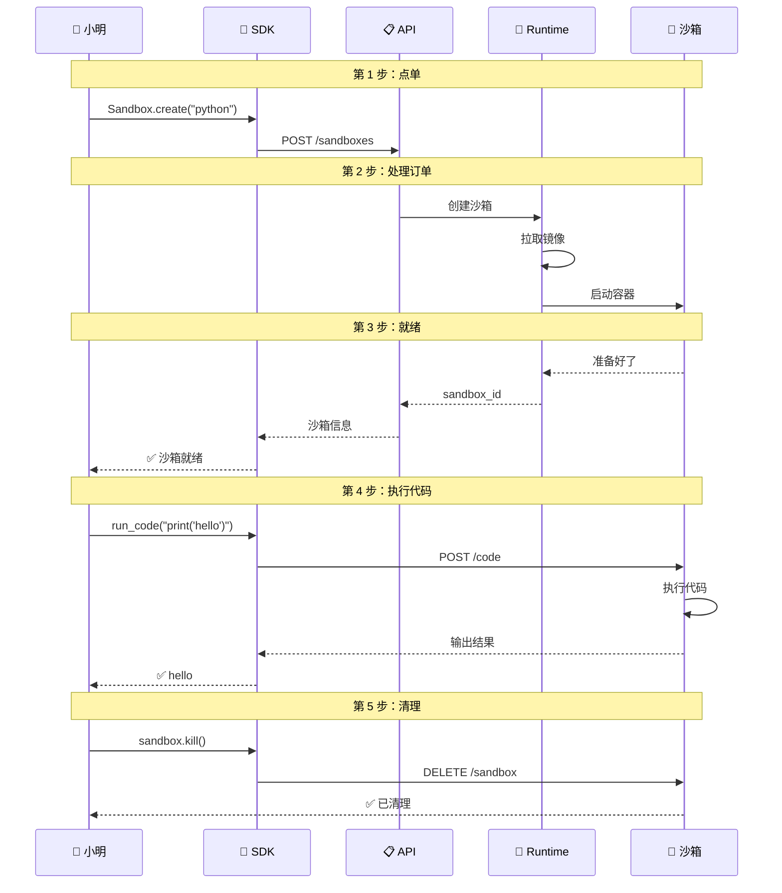

# OpenSandbox 架构深度分析 v5 - 通俗易懂版

> **作者**：sandboxrosy  
> **日期**：2026-03-12  
> **阅读时间**：约 30 分钟  
> **版本**：v5.0 - 通俗易懂版  
> **适合人群**：产品经理、技术决策者、初学者

---

## 🎯 5 分钟快速理解

### OpenSandbox 是什么？

**一句话解释**：OpenSandbox 就像一个"云端编程游乐场"，让 AI 可以在里面安全地写代码、运行程序，而不会搞坏你的电脑。

### 为什么需要它？

想象一下：
- 你让 AI 帮你写代码，AI 生成的代码可能有 bug，甚至有恶意代码
- 如果直接在你的电脑上运行，可能会删除文件、窃取数据
- OpenSandbox 就像一个**防爆玻璃房**，AI 在里面怎么折腾都安全

---

## 🏠 用"外卖系统"理解四层架构

### 生活类比

把 OpenSandbox 想象成一个**外卖平台**：

```
用户点餐 → 手机 App → 订单系统 → 餐厅 → 骑手 → 美食送达
    ↓
AI 写代码 → SDK → Specs 协议 → Runtime 运行时 → 沙箱 → 执行结果
```

### 四层架构对应关系

| 外卖系统 | OpenSandbox | 通俗解释 |
|----------|-------------|----------|
| **手机 App** | **SDK 层** | 你用的界面，点按钮下单 |
| **订单协议** | **Specs 层** | 规定订单格式（菜名、地址、数量） |
| **餐厅厨房** | **Runtime 层** | 真正做菜的地方（统筹调度） |
| **出餐窗口** | **Instance 层** | 每份菜做好放在哪里 |

---

## 📱 第一层：SDK - 用户界面

### 生活类比：外卖 App

就像你用美团/饿了么点餐：
- 不需要知道餐厅在哪
- 不需要知道怎么做菜
- 只需要点按钮："我要一份宫保鸡丁"

### SDK 做什么？

```python
# 5 行代码创建一个沙箱
from opensandbox import Sandbox

sandbox = Sandbox.create("python:3.11")  # 点一个 Python 环境
result = sandbox.commands.run("print('Hello!')")  # 运行代码
print(result.stdout)  # 查看结果
sandbox.kill()  # 关闭沙箱
```

**就像点外卖一样简单**：
1. 选择"口味"（Python/Java/...）
2. 下单
3. 等待送达
4. 享用结果

---

## 📋 第二层：Specs - 通用协议

### 生活类比：外卖订单格式

外卖平台规定订单必须包含：
- 菜品名称
- 数量
- 送餐地址
- 电话

**不管你用哪家外卖 App，订单格式都一样**。

### Specs 做什么？

OpenSandbox 定义了两种"订单格式"：

#### 1️⃣ 生命周期协议（管理沙箱）

| 操作 | 就像... | API |
|------|---------|-----|
| 创建沙箱 | 点外卖 | `POST /sandboxes` |
| 查看状态 | 查订单 | `GET /sandboxes/{id}` |
| 取消订单 | 退单 | `DELETE /sandboxes/{id}` |
| 延长保质期 | 续费 | `POST /sandboxes/{id}/renew` |

#### 2️⃣ 执行协议（运行代码）

| 操作 | 就像... | API |
|------|---------|-----|
| 运行代码 | 做菜 | `POST /code` |
| 执行命令 | 加配料 | `POST /command` |
| 上传文件 | 加小料 | `POST /files/upload` |

**好处**：任何语言都可以用同样的方式调用，就像任何手机都能点外卖。

---

## 🏪 第三层：Runtime - 中央厨房

### 生活类比：餐厅后厨

餐厅后厨负责：
- 接收订单
- 分配厨师
- 监控做菜进度
- 处理异常（菜没了、厨师请假）

### Runtime 做什么？

OpenSandbox 支持两种"厨房模式"：

#### 模式一：Docker Runtime（小厨房）

```
适合：开发测试、小规模使用
就像：家门口的小餐馆，上菜快，但容量有限
```

**流程**：
1. 收到订单（创建沙箱请求）
2. 准备食材（拉取容器镜像）
3. 开始做菜（启动容器）
4. 上菜（返回沙箱地址）

#### 模式二：Kubernetes Runtime（中央厨房）

```
适合：生产环境、大规模使用
就像：大型中央厨房，可以同时做 1000 份菜
```

**特色功能**：
- **批量做菜**：一次做 100 份（BatchSandbox）
- **预制菜池**：提前准备好，随点随有（Pool 预热）
- **自动扩容**：订单多了自动开新灶台

**性能对比**：

| 场景 | 小厨房模式 | 中央厨房模式 |
|------|-----------|-------------|
| 做 100 份菜 | 76 秒 | **0.92 秒** |
| 做法简单 | 单份做 | 批量预制 |

---

## 🍱 第四层：Instance - 每一份菜

### 生活类比：外卖盒子

每一份外卖包含：
- 主菜（用户代码）
- 餐具（执行工具）
- 调料包（Jupyter 内核）

### Instance 内部有什么？

```
┌─────────────────────────────────┐
│      沙箱实例（外卖盒）          │
├─────────────────────────────────┤
│ 🍱 用户代码（主菜）              │
│    - 你写的 Python 代码          │
├─────────────────────────────────┤
│ 🥢 execd 守护进程（餐具）        │
│    - 接收指令                    │
│    - 执行代码                    │
│    - 返回结果                    │
├─────────────────────────────────┤
│ 🧂 Jupyter 内核（调料）          │
│    - 理解代码                    │
│    - 执行代码                    │
│    - 保存变量                    │
└─────────────────────────────────┘
```

### execd 是什么？

**execd = 专属服务员**

每个沙箱都有一个 execd 进程，就像每个包间都有专属服务员：

- 你说："运行这段代码" → execd 接收指令
- execd 转告 Jupyter："客人要执行代码"
- Jupyter 执行代码，返回结果
- execd 把结果给你

---

## 🔄 整体链路：一次代码执行的旅程

### 故事：小明让 AI 写代码

**场景**：小明让 AI 帮他写一个计算斐波那契数列的程序

#### 第 1 步：点单（SDK 层）

```python
# 小明的代码
from opensandbox import Sandbox

sandbox = Sandbox.create("python:3.11")
```

**就像**：小明打开外卖 App，点了一份"Python 环境"

#### 第 2 步：订单传递（Specs 层）

```
SDK 发送请求：
POST /v1/sandboxes
{
  "image": "python:3.11",
  "timeout": "30m"
}
```

**就像**：订单信息发送到餐厅系统

#### 第 3 步：厨房处理（Runtime 层）

```
1. 收到订单
2. 检查库存（镜像缓存）
3. 准备食材（拉取镜像）
4. 开始做菜（创建容器）
5. 注入服务员（启动 execd）
```

**就像**：餐厅后厨开始做菜

#### 第 4 步：出餐（Instance 层）

```
容器启动：
- Python 环境就绪
- execd 监听 :44772 端口
- Jupyter 就绪 :54321 端口
```

**就像**：菜做好了，放在取餐窗口

#### 第 5 步：执行代码

```python
code = """
def fibonacci(n):
    if n <= 1:
        return n
    return fibonacci(n-1) + fibonacci(n-2)

print(fibonacci(10))
"""

result = sandbox.interpreter.run_code(code)
print(result.stdout)  # 输出: 55
```

**就像**：外卖送到，小明开始吃

#### 第 6 步：清理

```python
sandbox.kill()
```

**就像**：吃完饭，扔掉外卖盒

---

## 🎨 可视化：一次请求的完整流程



---

## 🛡️ 安全性：为什么安全？

### 生活类比：防爆玻璃房

想象一个玻璃房：
- 你可以在里面做任何事
- 但出不来了
- 也看不到外面
- 房子坏了也不影响外面

### OpenSandbox 的安全设计

| 安全措施 | 类比 | 作用 |
|----------|------|------|
| **容器隔离** | 玻璃房 | 代码只能在里面运行 |
| **资源限制** | 限时供应 | 不能无限制使用 CPU/内存 |
| **网络控制** | 只有外卖窗口 | 只能访问允许的网站 |
| **自动销毁** | 30 分钟后关门 | 防止长期占用 |

### 多级安全选项

```
┌─────────────────────────────────────────────┐
│           安全级别递增                        │
├─────────────────────────────────────────────┤
│  🟢 Docker/runc    - 基础隔离（玻璃房）       │
│  🟡 gVisor         - 增强隔离（加厚玻璃）     │
│  🟠 Firecracker    - 硬件隔离（独立小屋）     │
│  🔴 Kata Containers - 最强隔离（防爆室）      │
└─────────────────────────────────────────────┘
```

---

## 🚀 性能：为什么快？

### 预热池机制

**生活类比**：预制菜

- 正常做菜：点单 → 洗菜 → 切菜 → 炒菜 → 出餐（5 分钟）
- 预制菜：点单 → 热一下 → 出餐（30 秒）

### OpenSandbox 的预热

```
传统方式：
  请求 → 创建容器 → 启动 → 就绪
  时间：2-5 秒

预热方式：
  提前创建好一批容器放在池子里
  请求 → 从池子里取一个 → 就绪
  时间：50-150 毫秒
```

### 批量创建

**生活类比**：流水线

- 单份做：一份一份做，效率低
- 批量做：流水线，效率高

```
创建 100 个沙箱：
  传统方式：76 秒
  批量创建：0.92 秒（快 80 倍）
```

---

## 🆚 与其他方案对比

### 用餐厅类比

| 方案 | 类比 | 特点 |
|------|------|------|
| **OpenSandbox** | 中央厨房 + 预制菜 | 开源、可自建、快 |
| **E2B** | 外卖平台 | 专做 AI、不开源 |
| **Modal** | 自助餐厅 | 一体化、不开源 |
| **Firecracker** | 烹饪设备 | 只提供隔离层 |

### 如何选择？

```
需要自建？
  是 → OpenSandbox 或 Firecracker
  否 → E2B 或 Modal

需要多语言 SDK？
  是 → OpenSandbox
  否 → 都可以

需要 Kubernetes？
  是 → OpenSandbox 或 Kata
  否 → 都可以

需要批量创建？
  是 → OpenSandbox（BatchSandbox）
  否 → 都可以
```

---

## 📚 学习路径建议

### 初学者（产品经理/技术决策者）

1. 理解核心概念：沙箱、隔离、安全
2. 了解四层架构：SDK → Specs → Runtime → Instance
3. 知道应用场景：AI Agent、代码执行、自动化测试

### 开发者

1. 学习 SDK 使用（Python/TypeScript）
2. 理解 API 协议
3. 尝试本地部署
4. 学习自定义扩展

### 架构师

1. 深入理解架构设计
2. 学习 Kubernetes 部署
3. 性能调优与安全加固
4. 高可用方案设计

---

## 🎯 总结：一句话记住每一层

| 层级 | 一句话 | 类比 |
|------|--------|------|
| **SDK** | 点菜的 App | 📱 外卖 App |
| **Specs** | 订单的标准格式 | 📋 订单协议 |
| **Runtime** | 做菜的厨房 | 🏪 中央厨房 |
| **Instance** | 每一份菜 | 🍱 外卖盒子 |

---

## 🔗 快速链接

- **GitHub**：https://github.com/alibaba/OpenSandbox
- **文档**：https://open-sandbox.ai/
- **Python SDK**：`pip install opensandbox`

---

## ❓ 常见问题

**Q：OpenSandbox 和 Docker 有什么区别？**
> Docker 只是隔离工具，OpenSandbox 是完整的平台，包含 SDK、API、管理等功能。就像 Docker 是厨房，OpenSandbox 是整个外卖系统。

**Q：为什么需要预热池？**
> 创建容器需要时间（几秒），预热池提前创建好，用的时候直接取，快 10-100 倍。就像预制菜比现做快。

**Q：安全吗？AI 生成的代码会不会有病毒？**
> 安全。沙箱是隔离的，代码在里面运行，访问不了你的电脑。就像玻璃房里的人出不来。

**Q：支持哪些编程语言？**
> Python、Java、JavaScript、TypeScript、Go、Bash 等。SDK 支持 Python、Java、TypeScript、C#、Go。

**Q：可以在本地部署吗？**
> 可以。用 Docker 或 Kubernetes 都可以。适合企业内网部署。

---

> **关于本文档**  
> 本文档用通俗易懂的语言解释 OpenSandbox 架构，适合非技术人员理解。  
> 作者：sandboxrosy | 日期：2026-03-12 | 版本：v5.0

---

*最后更新：2026-03-12 | v5.0 - 通俗易懂版*