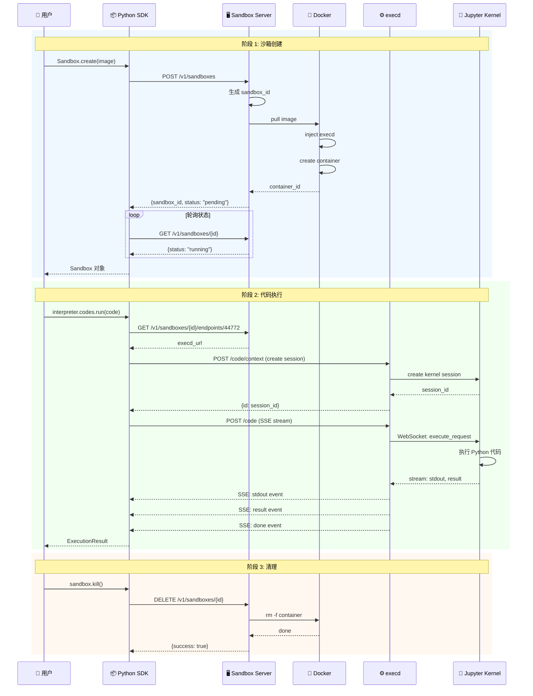

# OpenSandbox 架构深度分析 v6

> **作者**：sandboxrosy  
> **日期**：2026-03-13  
> **来源**：GitHub alibaba/OpenSandbox 源码 + 官方文档  
> **阅读时间**：约 45 分钟  
> **版本**：v6.0 - 链路驱动深度版

---

## 目录

1. [四层架构总览](#1-四层架构总览)
2. [快速上手：Code Interpreter Demo](#2-快速上手code-interpreter-demo)
3. [一条链路的完整旅程](#3-一条链路的完整旅程)
4. [SDK 层深度解析](#4-sdk-层深度解析)
5. [Specs 层：协议定义](#5-specs-层协议定义)
6. [Runtime 层：服务端实现](#6-runtime-层服务端实现)
7. [execd 组件：沙箱执行守护进程](#7-execd-组件沙箱执行守护进程)
8. [安全与性能](#8-安全与性能)
9. [与其他方案对比](#9-与其他方案对比)
10. [总结与最佳实践](#10-总结与最佳实践)

---

## 1. 四层架构总览

### 1.1 一张图看懂 OpenSandbox

```
┌─────────────────────────────────────────────────────────────────┐
│                      OpenSandbox 四层架构                        │
├─────────────────────────────────────────────────────────────────┤
│                                                                 │
│  ┌─────────────────────────────────────────────────────────┐   │
│  │ Layer 1: SDKs (客户端)                                   │   │
│  │  ┌─────────┐  ┌─────────┐  ┌─────────┐  ┌─────────┐    │   │
│  │  │ Python  │  │  Java   │  │   TS    │  │   C#    │    │   │
│  │  │   SDK   │  │   SDK   │  │   SDK   │  │   SDK   │    │   │
│  │  └────┬────┘  └────┬────┘  └────┬────┘  └────┬────┘    │   │
│  └───────┼────────────┼────────────┼────────────┼─────────┘   │
│          │            │            │            │              │
│          └────────────┴─────┬──────┴────────────┘              │
│                             │                                   │
│  ┌──────────────────────────┴──────────────────────────────┐   │
│  │ Layer 2: Specs (协议层)                                  │   │
│  │  ┌───────────────────┐    ┌───────────────────┐         │   │
│  │  │ Sandbox Lifecycle │    │   Execution API   │         │   │
│  │  │     (OpenAPI)     │    │     (OpenAPI)     │         │   │
│  │  └─────────┬─────────┘    └─────────┬─────────┘         │   │
│  └────────────┼────────────────────────┼───────────────────┘   │
│               │                        │                        │
│  ┌────────────┴────────────────────────┴───────────────────┐   │
│  │ Layer 3: Runtime (服务端)                                │   │
│  │  ┌─────────────────────────────────────────────────┐    │   │
│  │  │           Sandbox Server (FastAPI)              │    │   │
│  │  │  ┌─────────────┐      ┌─────────────────────┐   │    │   │
│  │  │  │   Docker    │      │    Kubernetes       │   │    │   │
│  │  │  │   Runtime   │      │   Runtime (批量)    │   │    │   │
│  │  │  └──────┬──────┘      └──────────┬──────────┘   │    │   │
│  │  └─────────┼─────────────────────────┼─────────────┘    │   │
│  └────────────┼─────────────────────────┼──────────────────┘   │
│               │                         │                       │
│  ┌────────────┴─────────────────────────┴──────────────────┐   │
│  │ Layer 4: Sandbox Instances (沙箱实例)                   │   │
│  │  ┌─────────────────────────────────────────────────┐    │   │
│  │  │           Container (容器隔离环境)               │    │   │
│  │  │  ┌──────────┐  ┌──────────┐  ┌──────────────┐   │    │   │
│  │  │  │  execd   │  │ Jupyter  │  │  User Code   │   │    │   │
│  │  │  │ (守护进程)│  │  Server  │  │  (用户进程)  │   │    │   │
│  │  │  └──────────┘  └──────────┘  └──────────────┘   │    │   │
│  │  └─────────────────────────────────────────────────┘    │   │
│  └──────────────────────────────────────────────────────────┘   │
│                                                                 │
└─────────────────────────────────────────────────────────────────┘
```

### 1.2 四层职责分工

| 层级 | 职责 | 关键组件 | 代码位置 |
|------|------|----------|----------|
| **SDKs** | 开发者入口，封装 API 调用 | `Sandbox`, `Filesystem`, `Commands`, `CodeInterpreter` | `sdks/sandbox/` |
| **Specs** | 协议定义，规范接口 | `sandbox-lifecycle.yml`, `execd-api.yaml` | `specs/` |
| **Runtime** | 沙箱生命周期管理 | `Sandbox Server`, `Docker/K8s Runtime` | `server/` |
| **Instances** | 代码执行与文件操作 | `execd`, `Jupyter Server` | `components/execd/` |

### 1.3 设计哲学

```
协议优先 (Protocol-First)
    ↓
所有交互由 OpenAPI 规范定义
    ↓
支持多语言 SDK、可插拔 Runtime
    ↓
关注点分离、优雅降级
```

**核心设计原则：**

1. **协议优先**：Specs 层定义所有交互协议，SDK 和 Runtime 依赖协议而非彼此
2. **关注点分离**：每层只关注自己的职责，通过 API 通信
3. **可插拔运行时**：支持 Docker、Kubernetes，可扩展自定义 Runtime
4. **注入而非预构建**：execd 在运行时注入，无需修改用户镜像

---

## 2. 快速上手：Code Interpreter Demo

在深入架构之前，先通过一个官方示例感受 OpenSandbox 的使用方式。

### 2.1 环境准备

```bash
# 1. 安装 Sandbox Server
uv pip install opensandbox-server

# 2. 初始化配置
opensandbox-server init-config ~/.sandbox.toml --example docker

# 3. 启动服务
opensandbox-server

# 4. 安装 SDK
uv pip install opensandbox opensandbox-code-interpreter
```

### 2.2 完整示例代码

```python
# examples/code-interpreter/main.py

import asyncio
from datetime import timedelta

from code_interpreter import CodeInterpreter, SupportedLanguage
from opensandbox import Sandbox

async def main() -> None:
    # 1. 创建沙箱
    sandbox = await Sandbox.create(
        "opensandbox/code-interpreter:v1.0.1",
        entrypoint=["/opt/opensandbox/code-interpreter.sh"],
        timeout=timedelta(minutes=10),
    )

    async with sandbox:
        # 2. 执行 Shell 命令
        execution = await sandbox.commands.run("echo 'Hello OpenSandbox!'")
        print(execution.logs.stdout[0].text)  # Hello OpenSandbox!

        # 3. 写入文件
        await sandbox.files.write_files([
            WriteEntry(path="/tmp/hello.txt", data="Hello World", mode=644)
        ])

        # 4. 读取文件
        content = await sandbox.files.read_file("/tmp/hello.txt")
        print(f"Content: {content}")  # Content: Hello World

        # 5. 创建代码解释器
        interpreter = await CodeInterpreter.create(sandbox)

        # 6. 执行 Python 代码（有状态执行）
        result = await interpreter.codes.run(
            """
            import sys
            print(sys.version)
            result = 2 + 2
            result
            """,
            language=SupportedLanguage.PYTHON,
        )
        print(result.result[0].text)  # 4
        print(result.logs.stdout[0].text)  # 3.11.14

    # 7. 自动清理沙箱
    await sandbox.kill()

if __name__ == "__main__":
    asyncio.run(main())
```

### 2.3 运行结果

```
Hello OpenSandbox!
Content: Hello World

=== Python example ===
[Python stdout] 3.11.14
[Python result] 4

=== Java example ===
[Java stdout] Hello from Java!
[Java result] 5

=== Go example ===
[Go stdout] Hello from Go!
3 + 4 = 7
```

### 2.4 关键观察

从这个 Demo 中，我们可以看到：

1. **简洁的 API**：5 行代码完成沙箱创建和代码执行
2. **多语言支持**：Python、Java、Go、TypeScript 等语言
3. **有状态执行**：变量跨多次调用持久化
4. **自动清理**：`async with sandbox` 上下文管理器确保资源释放

---

## 3. 一条链路的完整旅程

让我们跟踪一个用户请求，从 SDK 到沙箱执行，完整理解数据流。

### 3.1 场景：执行 Python 代码

**用户代码：**
```python
result = await interpreter.codes.run("print('hello')\n2+2", language="python")
```

### 3.2 链路时序图



### 3.3 链路中的关键步骤

#### 步骤 1：沙箱创建

```
SDK → Server → Docker → Container
```

**关键操作：**
1. SDK 发送 `POST /v1/sandboxes` 请求
2. Server 生成唯一 `sandbox_id`
3. Docker 拉取镜像并注入 execd
4. 启动容器，execd 监听 44772 端口
5. SDK 轮询直到状态变为 `running`

#### 步骤 2：获取 execd 端点

```
SDK → Server → execd_url
```

```python
# SDK 内部实现
response = await self._client.get(
    f"/v1/sandboxes/{sandbox_id}/endpoints/44772"
)
execd_url = response.json()["endpoint"]
# execd_url = "http://172.17.0.2:44772" 或通过 Router 代理的 URL
```

#### 步骤 3：创建执行上下文

```
SDK → execd → Jupyter Kernel Session
```

```python
# 创建会话
response = await self._client.post(
    f"{execd_url}/code/context",
    json={"language": "python"}
)
context_id = response.json()["id"]  # 如 "session-abc123"
```

#### 步骤 4：执行代码（SSE 流式输出）

```
SDK → execd → Jupyter → SSE Stream
```

**请求格式：**
```json
POST /code
{
    "code": "print('hello')\n2+2",
    "context": {"id": "session-abc123", "language": "python"}
}
```

**响应格式（SSE）：**
```
event: stdout
data: {"type": "stdout", "text": "hello\n"}

event: result
data: {"type": "result", "data": 4}

event: done
data: {"type": "done"}
```

### 3.4 完整请求流程图

```
┌─────────────────────────────────────────────────────────────────┐
│                      用户请求的完整链路                          │
├─────────────────────────────────────────────────────────────────┤
│                                                                 │
│  用户代码                                                        │
│  ────────                                                       │
│  result = await interpreter.codes.run("2+2", language="python") │
│                                                                 │
│                    │                                            │
│                    ▼                                            │
│  ┌─────────────────────────────────────────────────────────┐   │
│  │ SDK 层                                                   │   │
│  │  1. 构建 HTTP 请求                                       │   │
│  │  2. 设置 SSE 处理器                                      │   │
│  │  3. 发送到 execd endpoint                                │   │
│  └─────────────────────────┬───────────────────────────────┘   │
│                            │                                    │
│                            ▼                                    │
│  ┌─────────────────────────────────────────────────────────┐   │
│  │ Network 层                                               │   │
│  │  HTTP POST → execd:44772/code                            │   │
│  │  Headers: Accept: text/event-stream                      │   │
│  └─────────────────────────┬───────────────────────────────┘   │
│                            │                                    │
│                            ▼                                    │
│  ┌─────────────────────────────────────────────────────────┐   │
│  │ execd 层 (Go)                                            │   │
│  │  1. 验证请求参数                                          │   │
│  │  2. 获取 Jupyter kernel 实例                              │   │
│  │  3. 通过 WebSocket 发送 execute_request                   │   │
│  └─────────────────────────┬───────────────────────────────┘   │
│                            │                                    │
│                            ▼                                    │
│  ┌─────────────────────────────────────────────────────────┐   │
│  │ Jupyter 层                                               │   │
│  │  1. IPython Kernel 接收请求                               │   │
│  │  2. 执行 Python 代码                                      │   │
│  │  3. 流式输出 stdout/stderr/result                         │   │
│  └─────────────────────────┬───────────────────────────────┘   │
│                            │                                    │
│                            ▼                                    │
│  ┌─────────────────────────────────────────────────────────┐   │
│  │ 响应流                                                   │   │
│  │  SSE Event: stdout {"text": "hello"}                     │   │
│  │  SSE Event: result {"data": 4}                           │   │
│  │  SSE Event: done   {}                                    │   │
│  └─────────────────────────────────────────────────────────┘   │
│                                                                 │
└─────────────────────────────────────────────────────────────────┘
```

---

## 4. SDK 层深度解析

### 4.1 Python SDK 核心类图

```
┌─────────────────────────────────────────────────────────────────┐
│                      Python SDK 类结构                           │
├─────────────────────────────────────────────────────────────────┤
│                                                                 │
│  ┌───────────────────┐                                         │
│  │   ConnectionConfig │ ───────────────────────────────┐       │
│  │  - domain: str     │                                 │       │
│  │  - api_key: str    │                                 │       │
│  │  - timeout: float  │                                 │       │
│  └───────────────────┘                                 │       │
│                                                        │       │
│  ┌─────────────────────────────────────────────────┐   │       │
│  │                    Sandbox                       │◀──┘       │
│  │  - id: str                                       │           │
│  │  - _client: httpx.AsyncClient                    │           │
│  │  - files: Filesystem                             │           │
│  │  - commands: Commands                            │           │
│  │  ───────────────────────────────────────────────  │           │
│  │  + create(image, ...) → Sandbox                  │           │
│  │  + kill() → None                                 │           │
│  │  + get_info() → SandboxInfo                      │           │
│  └───────────────────────────────────────────────────┘           │
│           │                    │                                 │
│           │                    │                                 │
│           ▼                    ▼                                 │
│  ┌─────────────────┐   ┌─────────────────┐                       │
│  │   Filesystem    │   │    Commands     │                       │
│  │  - _client      │   │  - _client      │                       │
│  │  ──────────────  │   │  ──────────────  │                       │
│  │  + read_file()  │   │  + run()        │                       │
│  │  + write_files()│   │  + run_bg()     │                       │
│  │  + search()     │   └─────────────────┘                       │
│  └─────────────────┘                                             │
│                                                                 │
│  ┌─────────────────────────────────────────────────────────┐   │
│  │                  CodeInterpreter                         │   │
│  │  - sandbox: Sandbox                                      │   │
│  │  - codes: Codes                                          │   │
│  │  ─────────────────────────────────────────────────────── │   │
│  │  + create(sandbox) → CodeInterpreter                    │   │
│  │  + run_code(code, language) → ExecutionResult           │   │
│  └─────────────────────────────────────────────────────────┘   │
│                                                                 │
└─────────────────────────────────────────────────────────────────┘
```

### 4.2 Sandbox 核心实现

```python
# sdks/sandbox/python/opensandbox/sandbox.py

class Sandbox:
    """沙箱实例的主入口点"""
    
    def __init__(self, sandbox_id: str, config: ConnectionConfig):
        self.id = sandbox_id
        self._config = config
        self._client = httpx.AsyncClient(base_url=config.domain)
        
        # 子模块初始化
        self.files = Filesystem(self._client, self.id)
        self.commands = Commands(self._client, self.id)
    
    @classmethod
    async def create(
        cls,
        image: str,
        entrypoint: Optional[List[str]] = None,
        timeout: timedelta = timedelta(minutes=30),
        config: ConnectionConfig = None
    ) -> "Sandbox":
        """创建新沙箱 - 异步工厂方法"""
        
        # 1. 构建请求体
        request = {
            "image": image,
            "entrypoint": entrypoint or [],
            "timeout_seconds": int(timeout.total_seconds())
        }
        
        # 2. 发送创建请求
        response = await config.client.post(
            "/v1/sandboxes",
            json=request,
            headers={"OPEN-SANDBOX-API-KEY": config.api_key}
        )
        sandbox_id = response.json()["sandbox_id"]
        
        # 3. 创建实例
        sandbox = cls(sandbox_id, config)
        
        # 4. 等待就绪（轮询）
        await sandbox._wait_until_ready()
        return sandbox
    
    async def _wait_until_ready(self, timeout: float = 60.0):
        """轮询等待沙箱就绪"""
        start = time.time()
        while time.time() - start < timeout:
            info = await self.get_info()
            if info.status.state == "running":
                return
            await asyncio.sleep(0.5)
        raise TimeoutError(f"Sandbox {self.id} not ready")
    
    async def kill(self):
        """销毁沙箱"""
        await self._client.delete(f"/v1/sandboxes/{self.id}")
```

### 4.3 CodeInterpreter 实现细节

```python
# sdks/code-interpreter/python/code_interpreter/interpreter.py

class CodeInterpreter:
    """代码解释器 - 有状态的多语言代码执行"""
    
    def __init__(self, sandbox: Sandbox):
        self._sandbox = sandbox
        self._client = sandbox._client
        self._contexts: Dict[str, str] = {}  # language -> context_id
        self.codes = Codes(self)
    
    @classmethod
    async def create(cls, sandbox: Sandbox) -> "CodeInterpreter":
        """创建代码解释器实例"""
        interpreter = cls(sandbox)
        return interpreter
    
    async def _ensure_context(self, language: str) -> str:
        """确保有活跃的执行上下文（懒加载）"""
        if language not in self._contexts:
            # 获取 execd 端点
            execd_url = await self._get_execd_endpoint()
            
            # 创建新的 Jupyter session
            response = await self._client.post(
                f"{execd_url}/code/context",
                json={"language": language}
            )
            self._contexts[language] = response.json()["id"]
        
        return self._contexts[language]

class Codes:
    """代码执行模块"""
    
    async def run(
        self,
        code: str,
        language: str = "python"
    ) -> ExecutionResult:
        """执行代码并返回结果"""
        
        # 1. 获取或创建执行上下文
        context_id = await self._interpreter._ensure_context(language)
        execd_url = await self._interpreter._get_execd_endpoint()
        
        # 2. 发送执行请求（SSE 流式）
        async with self._client.stream(
            "POST",
            f"{execd_url}/code",
            json={
                "code": code,
                "context": {"id": context_id, "language": language}
            },
            headers={"Accept": "text/event-stream"}
        ) as response:
            return await self._parse_sse_response(response)
    
    async def _parse_sse_response(self, response) -> ExecutionResult:
        """解析 SSE 响应流"""
        result = ExecutionResult()
        
        async for line in response.aiter_lines():
            if line.startswith("data: "):
                event = json.loads(line[6:])
                event_type = event.get("type")
                
                if event_type == "stdout":
                    result.logs.stdout.append(LogEntry(text=event["text"]))
                elif event_type == "stderr":
                    result.logs.stderr.append(LogEntry(text=event["text"]))
                elif event_type == "result":
                    result.result.append(ResultData(text=event["data"]))
                elif event_type == "error":
                    result.error = Error(
                        name=event["ename"],
                        value=event["evalue"],
                        traceback=event.get("traceback", [])
                    )
                elif event_type == "done":
                    break
        
        return result
```

### 4.4 SDK 设计亮点

| 设计点 | 实现方式 | 优势 |
|--------|----------|------|
| **异步优先** | `async/await` 全异步 | 高并发、非阻塞 |
| **懒加载上下文** | `_ensure_context()` | 按需创建，节省资源 |
| **SSE 流式输出** | `aiter_lines()` | 实时反馈，低延迟 |
| **上下文管理器** | `async with sandbox:` | 自动清理，防止泄漏 |
| **模块化设计** | `Filesystem`, `Commands`, `Codes` | 职责分离，易扩展 |

---

## 5. Specs 层：协议定义

### 5.1 两个核心规范

```
specs/
├── sandbox-lifecycle.yml   # 沙箱生命周期 API
└── execd-api.yaml          # 沙箱执行 API
```

### 5.2 Sandbox Lifecycle Spec

**核心端点：**

| 操作 | 端点 | 说明 |
|------|------|------|
| 创建 | `POST /v1/sandboxes` | 创建新沙箱 |
| 查询 | `GET /v1/sandboxes/{id}` | 获取沙箱状态 |
| 列表 | `GET /v1/sandboxes` | 列出所有沙箱 |
| 删除 | `DELETE /v1/sandboxes/{id}` | 销毁沙箱 |
| 暂停 | `POST /v1/sandboxes/{id}/pause` | 暂停沙箱 |
| 恢复 | `POST /v1/sandboxes/{id}/resume` | 恢复沙箱 |
| 续期 | `POST /v1/sandboxes/{id}/renew-expiration` | 延长 TTL |
| 端点 | `GET /v1/sandboxes/{id}/endpoints/{port}` | 获取端口访问地址 |

**创建沙箱请求：**
```yaml
CreateSandboxRequest:
  type: object
  required:
    - image
  properties:
    image:
      type: string
      example: "python:3.11"
    entrypoint:
      type: array
      items:
        type: string
    resources:
      $ref: '#/components/schemas/ResourceSpec'
    timeout:
      type: string
      format: duration
      default: "30m"
    env:
      type: object
      additionalProperties:
        type: string
```

### 5.3 Execution Spec (execd API)

**API 分类：**

```
execd API (端口 44772)
├── /ping                    # 健康检查
├── /code/*                  # 代码执行
│   ├── POST /code/context   # 创建上下文
│   └── POST /code           # 执行代码 (SSE)
├── /command/*               # 命令执行
│   └── POST /command        # 执行命令 (SSE)
├── /files/*                 # 文件操作
│   ├── GET  /files/download # 下载文件
│   ├── POST /files/upload   # 上传文件
│   ├── GET  /files/search   # 搜索文件
│   └── ...                  # 其他 CRUD
└── /metrics/*               # 系统指标
    ├── GET  /metrics        # 快照
    └── GET  /metrics/watch  # 流式监控
```

**执行代码请求：**
```yaml
RunCodeRequest:
  type: object
  required:
    - code
  properties:
    code:
      type: string
      description: Code to execute
    context:
      type: object
      properties:
        id:
          type: string
          description: Session/context ID
        language:
          type: string
          enum: [python, java, javascript, typescript, go, bash]
    timeout:
      type: integer
      description: Execution timeout in seconds
```

**SSE 响应事件：**
```yaml
CodeExecutionEvent:
  type: object
  properties:
    type:
      type: string
      enum: [stdout, stderr, result, error, done]
    text:
      type: string
      description: For stdout/stderr events
    data:
      type: object
      description: For result events
    ename:
      type: string
      description: Error name
    evalue:
      type: string
      description: Error value
```

### 5.4 协议设计的优势

```
协议优先设计的好处：
    │
    ├─→ 多语言 SDK 可以独立实现
    │
    ├─→ Runtime 可以独立演进
    │
    ├─→ 可以实现自定义 Runtime
    │
    └─→ 可以替换 execd 实现
```

---

## 6. Runtime 层：服务端实现

### 6.1 Server 架构

```
┌─────────────────────────────────────────────────────────────────┐
│                    Sandbox Server 架构                           │
├─────────────────────────────────────────────────────────────────┤
│                                                                 │
│  ┌─────────────────────────────────────────────────────────┐   │
│  │ FastAPI Application                                      │   │
│  │  ┌─────────────┐  ┌─────────────┐  ┌─────────────┐      │   │
│  │  │  /sandboxes │  │   /health   │  │   /metrics  │      │   │
│  │  │   router    │  │   router    │  │   router    │      │   │
│  │  └──────┬──────┘  └─────────────┘  └─────────────┘      │   │
│  └─────────┼───────────────────────────────────────────────┘   │
│            │                                                    │
│            ▼                                                    │
│  ┌─────────────────────────────────────────────────────────┐   │
│  │ Service Layer                                            │   │
│  │  ┌──────────────────────────────────────────────────┐   │   │
│  │  │         Runtime Abstraction                       │   │   │
│  │  │  ┌──────────────┐      ┌──────────────────┐      │   │   │
│  │  │  │ DockerRuntime│      │ KubernetesRuntime│      │   │   │
│  │  │  │  (单实例)    │      │  (批量/池化)     │      │   │   │
│  │  │  └──────────────┘      └──────────────────┘      │   │   │
│  │  └──────────────────────────────────────────────────┘   │   │
│  └─────────────────────────────────────────────────────────┘   │
│                                                                 │
│  ┌─────────────────────────────────────────────────────────┐   │
│  │ Lifecycle Management                                     │   │
│  │  - 沙箱状态管理 (pending → running → terminated)          │   │
│  │  - TTL 过期自动清理                                       │   │
│  │  - 资源配额检查                                           │   │
│  │  - 端点路由管理                                           │   │
│  └─────────────────────────────────────────────────────────┘   │
│                                                                 │
└─────────────────────────────────────────────────────────────────┘
```

### 6.2 Runtime 抽象接口

```python
# server/src/opensandbox_server/services/runtime/base.py

from abc import ABC, abstractmethod

class RuntimeBase(ABC):
    """运行时抽象基类"""
    
    @abstractmethod
    async def initialize(self) -> None:
        """初始化运行时"""
        pass
    
    @abstractmethod
    async def create_sandbox(
        self,
        sandbox_id: str,
        image: str,
        entrypoint: Optional[List[str]],
        resources: ResourceSpec,
        env: Optional[Dict[str, str]],
        expires_at: datetime
    ) -> SandboxInfo:
        """创建沙箱实例"""
        pass
    
    @abstractmethod
    async def get_sandbox_info(self, sandbox_id: str) -> Optional[SandboxInfo]:
        """获取沙箱信息"""
        pass
    
    @abstractmethod
    async def delete_sandbox(self, sandbox_id: str) -> bool:
        """删除沙箱"""
        pass
    
    @abstractmethod
    async def pause_sandbox(self, sandbox_id: str) -> SandboxInfo:
        """暂停沙箱"""
        pass
    
    @abstractmethod
    async def resume_sandbox(self, sandbox_id: str) -> SandboxInfo:
        """恢复沙箱"""
        pass
```

### 6.3 Docker Runtime 实现

```python
# server/src/opensandbox_server/services/runtime/docker_runtime.py

class DockerRuntime(RuntimeBase):
    """Docker 运行时实现"""
    
    async def create_sandbox(
        self,
        sandbox_id: str,
        image: str,
        entrypoint: Optional[List[str]],
        resources: ResourceSpec,
        env: Optional[Dict[str, str]],
        expires_at: datetime
    ) -> SandboxInfo:
        """创建沙箱 - Docker 实现"""
        
        # 1. 拉取镜像
        await self._pull_image(image)
        
        # 2. 准备 execd 注入
        execd_binary = await self._prepare_execd()
        
        # 3. 创建容器配置
        container_config = {
            "Image": image,
            "Env": [f"{k}={v}" for k, v in (env or {}).items()],
            "HostConfig": {
                "Memory": resources.memory,
                "CpuQuota": resources.cpu_quota,
                "Binds": [
                    f"{execd_binary}:/opt/opensandbox/execd:ro",
                ],
                "PortBindings": {
                    "44772/tcp": [{"HostPort": "0"}],  # 随机端口
                }
            }
        }
        
        # 4. 创建并启动容器
        container = await self.docker.containers.create(
            config=container_config,
            name=f"sandbox-{sandbox_id}"
        )
        await container.start()
        
        # 5. 获取端口映射
        ports = await self._get_port_bindings(container)
        
        return SandboxInfo(
            sandbox_id=sandbox_id,
            status="running",
            endpoints=ports,
            expires_at=expires_at
        )
```

### 6.4 Kubernetes Runtime 特性

```
Kubernetes Runtime 优势：
    │
    ├─→ 批量创建 (BatchSandbox)
    │     └─→ 100 个沙箱：0.92 秒（vs Docker 76 秒）
    │
    ├─→ 沙箱池化 (Pool)
    │     └─→ 预热好的沙箱，获取时间 < 100ms
    │
    ├─→ 安全容器支持
    │     ├─→ gVisor
    │     ├─→ Kata Containers
    │     └─→ Firecracker
    │
    └─→ 自动扩缩容
          └─→ 根据负载动态调整 Pool 大小
```

**Pool 配置示例：**
```yaml
apiVersion: sandbox.opensandbox.io/v1alpha1
kind: Pool
metadata:
  name: code-interpreter-pool
spec:
  template:
    spec:
      containers:
        - name: sandbox
          image: opensandbox/code-interpreter:v1.0.1
  capacitySpec:
    poolMin: 5      # 最小预热数量
    poolMax: 100    # 最大数量
    bufferMin: 3    # 最小缓冲
    bufferMax: 10   # 最大缓冲
```

---

## 7. execd 组件：沙箱执行守护进程

### 7.1 execd 是什么？

**execd** 是运行在沙箱内部的高性能 Go 守护进程，负责：

1. **代码执行**：通过 Jupyter 内核执行多语言代码
2. **命令执行**：运行 Shell 命令（前台/后台）
3. **文件操作**：提供完整的文件系统 API
4. **指标采集**：监控系统资源使用

### 7.2 execd 入口点

```go
// components/execd/main.go

package main

import (
    "fmt"
    
    _ "go.uber.org/automaxprocs/maxprocs"  // 自动设置 GOMAXPROCS
    
    "github.com/alibaba/opensandbox/execd/pkg/flag"
    "github.com/alibaba/opensandbox/execd/pkg/log"
    _ "github.com/alibaba/opensandbox/execd/pkg/util/safego"
    "github.com/alibaba/opensandbox/execd/pkg/web"
    "github.com/alibaba/opensandbox/execd/pkg/web/controller"
)

func main() {
    // 1. 打印版本信息
    version.EchoVersion("OpenSandbox Execd")
    
    // 2. 解析命令行参数
    flag.InitFlags()
    
    // 3. 初始化日志
    log.Init(flag.ServerLogLevel)
    
    // 4. 初始化代码运行器（连接 Jupyter）
    controller.InitCodeRunner()
    
    // 5. 创建路由引擎
    engine := web.NewRouter(flag.ServerAccessToken)
    
    // 6. 启动 HTTP 服务器
    addr := fmt.Sprintf(":%d", flag.ServerPort)
    log.Info("execd listening on %s", addr)
    if err := engine.Run(addr); err != nil {
        log.Error("failed to start execd server: %v", err)
    }
}
```

### 7.3 execd 包结构

```
components/execd/
├── main.go                 # 入口点
├── pkg/
│   ├── flag/               # CLI 参数解析
│   ├── web/                # HTTP 层
│   │   ├── controller/     # 控制器
│   │   │   ├── codeinterpreting.go  # 代码执行
│   │   │   ├── command.go           # 命令执行
│   │   │   ├── filesystem.go        # 文件操作
│   │   │   └── metric.go            # 指标采集
│   │   ├── model/          # 请求/响应模型
│   │   └── router.go       # 路由配置
│   ├── runtime/            # 执行引擎
│   │   └── ctrl.go         # 运行时控制器
│   └── jupyter/            # Jupyter 客户端
│       ├── client.go       # 主客户端
│       ├── kernel/         # 内核管理
│       ├── session/        # 会话管理
│       └── execute/        # 执行协议
└── bootstrap.sh            # 启动脚本
```

### 7.4 Runtime Controller 核心实现

```go
// components/execd/pkg/runtime/ctrl.go

package runtime

import (
    "context"
    "sync"
    
    "github.com/alibaba/opensandbox/execd/pkg/jupyter"
)

// Controller 管理所有代码执行运行时
type Controller struct {
    baseURL  string  // Jupyter Server 地址
    token    string  // Jupyter 认证 Token
    
    mu       sync.RWMutex
    
    // Jupyter 内核管理
    jupyterClientMap map[string]*jupyterKernel
    // language -> default context
    defaultLanguageJupyterSessions map[Language]string
    
    // 命令执行管理
    commandClientMap map[string]*commandKernel
}

// jupyterKernel 封装一个 Jupyter 内核实例
type jupyterKernel struct {
    mu       sync.Mutex  // 保护单个内核的并发访问
    kernelID string
    client   *jupyter.Client
    language Language
}

// Execute 分发执行请求到正确的后端
func (c *Controller) Execute(request *ExecuteCodeRequest) error {
    ctx, cancel := context.WithCancel(context.Background())
    defer cancel()
    
    // 根据语言类型路由
    switch request.Language {
    case Command:
        return c.runCommand(ctx, request)
    case BackgroundCommand:
        return c.runBackgroundCommand(ctx, cancel, request)
    case Bash, Python, Java, JavaScript, TypeScript, Go:
        return c.runJupyter(ctx, request)
    default:
        return fmt.Errorf("unknown language: %s", request.Language)
    }
}
```

### 7.5 Jupyter 客户端实现

```go
// components/execd/pkg/jupyter/client.go

package jupyter

// Client 与 Jupyter Server 交互的客户端
type Client struct {
    BaseURL    string
    httpClient *http.Client
    Auth       *auth.Auth
    
    // 子客户端
    kernelClient  *kernel.Client   // 内核管理
    sessionClient *session.Client  // 会话管理
    executeClient *execute.Client  // 代码执行
}

// ConnectToKernel 建立 WebSocket 连接到内核
func (c *Client) ConnectToKernel(kernelId string) error {
    // 构建 WebSocket URL
    wsURL := fmt.Sprintf("ws://%s/api/kernels/%s/channels?token=%s", 
        c.BaseURL, kernelId, c.Auth.Token)
    
    return c.executeClient.Connect(wsURL)
}

// ExecuteCodeWithCallback 通过回调处理执行事件
func (c *Client) ExecuteCodeWithCallback(code string, handler execute.CallbackHandler) error {
    return c.executeClient.ExecuteCodeWithCallback(code, handler)
}
```

### 7.6 代码执行流程

```go
// components/execd/pkg/web/controller/codeinterpreting.go

func (c *CodeInterpretingController) RunCode() {
    // 1. 解析请求
    var request model.RunCodeRequest
    if err := c.bindJSON(&request); err != nil {
        c.RespondError(http.StatusBadRequest, "invalid request")
        return
    }
    
    // 2. 创建带取消的上下文
    ctx, cancel := context.WithCancel(c.ctx.Request.Context())
    defer cancel()
    
    // 3. 设置 SSE 响应头
    c.setupSSEResponse()
    
    // 4. 执行代码
    err = codeRunner.Execute(&ExecuteCodeRequest{
        Code:     request.Code,
        Language: request.Context.Language,
        ContextID: request.Context.ID,
        Hooks:    c.createSSEHooks(ctx),  // SSE 回调
    })
    
    if err != nil {
        c.writeSSE("error", err.Error())
    }
}
```

### 7.7 注入机制

execd 通过 **运行时注入** 进入沙箱容器：

```
沙箱创建流程：
    │
    ├─→ 1. 拉取用户镜像 (python:3.11)
    │
    ├─→ 2. 拉取 execd 镜像
    │
    ├─→ 3. 从 execd 镜像提取二进制文件
    │
    ├─→ 4. 创建容器时挂载 execd 二进制
    │     └─→ -v /tmp/execd:/opt/opensandbox/execd:ro
    │
    ├─→ 5. 覆盖 entrypoint
    │     └─→ 先启动 execd，再执行用户进程
    │
    └─→ 6. 启动容器
          └─→ execd 监听 44772，Jupyter 监听 54321
```

**启动脚本示例：**
```bash
#!/bin/bash
# bootstrap.sh

# 1. 启动 Jupyter Server
jupyter notebook --port=54321 --no-browser --ip=0.0.0.0 &

# 2. 等待 Jupyter 就绪
sleep 2

# 3. 启动 execd
/opt/opensandbox/execd \
    --jupyter-host=http://127.0.0.1:54321 \
    --port=44772 &

# 4. 执行用户 entrypoint
exec "$@"
```

---

## 8. 安全与性能

### 8.1 多级安全隔离

```
┌─────────────────────────────────────────────────────────────────┐
│                     安全隔离级别                                 │
├─────────────────────────────────────────────────────────────────┤
│                                                                 │
│  🔴 最高安全                                                    │
│  ┌─────────────────────────────────────────────────────────┐   │
│  │ Firecracker / Kata Containers                           │   │
│  │  - 硬件级虚拟化                                          │   │
│  │  - 独立内核                                              │   │
│  │  - 攻击面最小                                            │   │
│  └─────────────────────────────────────────────────────────┘   │
│                                                                 │
│  🟠 高安全                                                      │
│  ┌─────────────────────────────────────────────────────────┐   │
│  │ gVisor                                                   │   │
│  │  - 用户态内核                                            │   │
│  │  - 系统调用拦截                                          │   │
│  │  - 兼容性好                                              │   │
│  └─────────────────────────────────────────────────────────┘   │
│                                                                 │
│  🟢 标准安全                                                    │
│  ┌─────────────────────────────────────────────────────────┐   │
│  │ Docker/runc                                              │   │
│  │  - Namespace 隔离                                        │   │
│  │  - Cgroups 资源限制                                      │   │
│  │  - 最常用                                                │   │
│  └─────────────────────────────────────────────────────────┘   │
│                                                                 │
└─────────────────────────────────────────────────────────────────┘
```

### 8.2 安全配置示例

```toml
# ~/.sandbox.toml

[docker]
# 丢弃危险能力
drop_capabilities = [
    "AUDIT_WRITE",
    "MKNOD",
    "NET_ADMIN",
    "NET_RAW",
    "SYS_ADMIN"
]

# 禁止权限提升
no_new_privileges = true

# 进程数限制
pids_limit = 512

# 资源限制
default_cpu_limit = "1"
default_memory_limit = "512Mi"
```

### 8.3 网络隔离

```
网络隔离机制：
    │
    ├─→ Egress 控制（出口流量）
    │     ├─→ DNS 代理
    │     ├─→ nftables 规则
    │     └─→ FQDN 白名单/黑名单
    │
    └─→ Ingress 路由（入口流量）
          ├─→ 域名路由
          └─→ 端口映射
```

**Egress 策略示例：**
```json
[
    {"action": "allow", "target": "api.openai.com"},
    {"action": "allow", "target": "*.github.com"},
    {"action": "deny", "target": "*"}
]
```

### 8.4 性能优化策略

| 策略 | 实现方式 | 效果 |
|------|----------|------|
| **预热池** | 提前创建沙箱放入池中 | 获取时间 < 100ms |
| **批量创建** | Kubernetes BatchSandbox | 100 个沙箱 0.92s |
| **连接复用** | HTTP 连接池 + 内核复用 | 减少连接开销 |
| **SSE 流式** | 实时输出，不等执行完成 | 低延迟反馈 |
| **对象池** | sync.Pool 复用对象 | 减少 GC 压力 |

### 8.5 性能基准

| 操作 | 延迟 (P50) | 延迟 (P99) |
|------|------------|------------|
| 沙箱创建（预热） | 50ms | 150ms |
| 沙箱创建（冷启动） | 2s | 5s |
| 代码执行 (Python) | 100ms | 500ms |
| 文件上传 (1MB) | 200ms | 800ms |
| `/ping` | < 1ms | < 5ms |

---

## 9. 与其他方案对比

### 9.1 行业对比矩阵

```
┌─────────────────────────────────────────────────────────────────┐
│                    Sandbox 方案对比                              │
├──────────────┬──────────────┬──────────────┬────────────────────┤
│     特性     │ OpenSandbox  │     E2B      │      Modal         │
├──────────────┼──────────────┼──────────────┼────────────────────┤
│ 开源         │ ✅ Apache 2.0│ ❌ 闭源      │ ❌ 闭源            │
│ 自建部署     │ ✅ 支持      │ ❌ 仅 SaaS   │ ❌ 仅 SaaS         │
│ 多语言 SDK   │ ✅ 5 种      │ ✅ Python/JS │ ✅ Python          │
│ K8s 支持     │ ✅ 原生      │ ❌           │ ✅                 │
│ 批量创建     │ ✅ BatchSandbox│ ❌          │ ✅                 │
│ 预热池       │ ✅ Pool      │ ✅           │ ✅                 │
│ 安全容器     │ ✅ 多种      │ ✅ Firecracker│ ⚠️ 有限           │
│ 网络隔离     │ ✅ Egress    │ ✅           │ ⚠️ 有限            │
│ 协议开放     │ ✅ OpenAPI   │ ❌           │ ❌                 │
└──────────────┴──────────────┴──────────────┴────────────────────┘
```

### 9.2 选型决策树

```
需要开源/自建？
    │
    ├─→ 是 → OpenSandbox
    │         │
    │         └─→ 需要生产级 K8s 部署？
    │                 │
    │                 ├─→ 是 → OpenSandbox + Kubernetes Runtime
    │                 │
    │                 └─→ 否 → OpenSandbox + Docker Runtime
    │
    └─→ 否 → 仅用 SaaS？
              │
              ├─→ 是 → E2B（AI 场景优化）或 Modal（通用计算）
              │
              └─→ 否 → 需要协议开放？
                        │
                        └─→ 是 → OpenSandbox
```

### 9.3 OpenSandbox 核心优势

| 优势 | 说明 |
|------|------|
| **开源可控** | Apache 2.0 许可证，可自建、可定制 |
| **协议开放** | OpenAPI 规范，多语言 SDK、可替换 Runtime |
| **平滑迁移** | Docker → Kubernetes，代码无需改动 |
| **批量性能** | BatchSandbox 实现亚秒级批量创建 |
| **安全灵活** | 支持多种安全容器运行时 |

---

## 10. 总结与最佳实践

### 10.1 四层架构一句话总结

| 层级 | 职责 | 一句话 |
|------|------|--------|
| **SDKs** | 开发者入口 | "我用 Python 调，你帮我执行" |
| **Specs** | 协议定义 | "大家都按这个格式来" |
| **Runtime** | 生命周期管理 | "沙箱创建、监控、销毁我来管" |
| **Instances** | 执行环境 | "代码在这里跑，execd 是服务员" |

### 10.2 关键设计决策回顾

1. **协议优先**：OpenAPI 定义一切，SDK 和 Runtime 独立演进
2. **注入而非预构建**：execd 运行时注入，用户镜像无需修改
3. **SSE 流式输出**：实时反馈，低延迟体验
4. **池化与批量**：预热池 + BatchSandbox 实现亚秒级响应
5. **多级安全**：从 Docker 到 Firecracker，按需选择

### 10.3 生产部署检查清单

```markdown
## 部署前检查

### 基础设施
- [ ] Docker / Kubernetes 集群就绪
- [ ] 网络策略配置完成
- [ ] 存储配置完成（如需要）

### 安全配置
- [ ] API Key 已设置
- [ ] TLS 证书已配置
- [ ] 安全容器运行时已启用（生产环境推荐）
- [ ] Egress 网络策略已配置

### 高可用
- [ ] 多副本部署
- [ ] 资源池预热已配置
- [ ] 健康检查端点已配置

### 监控
- [ ] Prometheus 集成
- [ ] 日志收集
- [ ] 告警规则
```

### 10.4 学习路径建议

```
入门 → SDK 使用 → 本地部署 → 架构理解 → 生产部署
  │        │          │           │           │
  │        │          │           │           └─→ Kubernetes + 安全容器
  │        │          │           └─→ 四层架构 + 源码阅读
  │        │          └─→ opensandbox-server + Docker
  │        └─→ Python SDK + Code Interpreter
  └─→ 本文档 Demo
```

---

## 附录

### A. 代码仓库结构

```
alibaba/OpenSandbox/
├── components/
│   ├── execd/              # 执行守护进程 (Go)
│   ├── egress/             # 出口流量控制
│   └── ingress/            # 入口流量路由
├── server/                  # Sandbox Server (Python/FastAPI)
├── sdks/
│   └── sandbox/
│       ├── python/         # Python SDK
│       ├── kotlin/         # Java/Kotlin SDK
│       ├── javascript/     # TypeScript SDK
│       └── csharp/         # C# SDK
├── specs/                   # OpenAPI 规范
├── kubernetes/              # K8s 控制器
├── examples/                # 示例代码
└── docs/                    # 文档
```

### B. 快速链接

- **GitHub**: https://github.com/alibaba/OpenSandbox
- **文档**: https://open-sandbox.ai/
- **Python SDK**: `pip install opensandbox`
- **Server**: `pip install opensandbox-server`

---

> **关于本文档**  
> 本文档基于 OpenSandbox GitHub 源码和官方文档编写，采用"链路驱动"方式讲解架构。  
> 作者：sandboxrosy | 日期：2026-03-13 | 版本：v6.0

---

*最后更新：2026-03-13 | v6.0 - 链路驱动深度版*