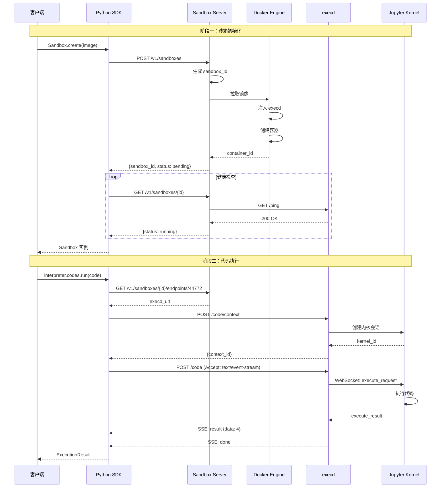

# OpenSandbox 架构深度解析

> **作者**：sandboxrosy  
> **日期**：2026-03-13  
> **来源**：GitHub alibaba/OpenSandbox 源码分析  
> **阅读时间**：约 50 分钟  
> **版本**：v6.1 - 技术讲座版

---

## 引言：问题空间与技术选型

在 AI Agent 和代码执行场景中，一个核心挑战始终存在：**如何在保证安全隔离的前提下，实现高效的代码执行与资源管理？**

传统的容器方案面临以下困境：

| 挑战 | 传统方案 | 局限性 |
|------|----------|--------|
| **安全隔离** | Docker/runc | 容器逃逸风险 |
| **启动延迟** | VM 方案 | 分钟级启动时间 |
| **资源效率** | 独立 VM | 高内存/CPU 开销 |
| **开发体验** | 自建平台 | 缺乏统一 API |

OpenSandbox 的设计目标正是解决这一矛盾：通过**协议优先的分层架构**，实现安全与效率的平衡。

本文将从架构设计、数据流、核心组件三个维度展开分析。

---

## 目录

1. [架构设计：四层分离](#1-架构设计四层分离)
2. [实践入口：Code Interpreter](#2-实践入口code-interpreter)
3. [数据流分析：请求的完整生命周期](#3-数据流分析请求的完整生命周期)
4. [组件详解：SDK 层](#4-组件详解sdk-层)
5. [组件详解：Specs 层](#5-组件详解specs-层)
6. [组件详解：Runtime 层](#6-组件详解runtime-层)
7. [组件详解：execd 守护进程](#7-组件详解execd-守护进程)
8. [安全架构与性能优化](#8-安全架构与性能优化)
9. [技术选型：与其他方案对比](#9-技术选型与其他方案对比)
10. [总结：设计原则与实践建议](#10-总结设计原则与实践建议)

---

## 1. 架构设计：四层分离

### 1.1 架构总览

OpenSandbox 采用严格的分层架构，每层通过明确定义的协议进行通信。这种设计源于一个核心原则：**协议优于实现**。

```
┌─────────────────────────────────────────────────────────────────┐
│                    OpenSandbox 分层架构                          │
├─────────────────────────────────────────────────────────────────┤
│                                                                 │
│  Layer 1: SDKs                                                  │
│  ┌──────────────────────────────────────────────────────────┐  │
│  │  Python SDK │ Java SDK │ TypeScript SDK │ C# SDK         │  │
│  │  多语言客户端，封装 HTTP 调用，提供类型安全的 API          │  │
│  └────────────────────────┬─────────────────────────────────┘  │
│                           │ OpenAPI Spec                        │
│  Layer 2: Specs           ▼                                     │
│  ┌──────────────────────────────────────────────────────────┐  │
│  │  sandbox-lifecycle.yml │ execd-api.yaml                   │  │
│  │  协议定义层，规定接口契约，解耦 SDK 与 Runtime            │  │
│  └────────────────────────┬─────────────────────────────────┘  │
│                           │ HTTP API                            │
│  Layer 3: Runtime         ▼                                     │
│  ┌──────────────────────────────────────────────────────────┐  │
│  │  Sandbox Server (FastAPI)                                 │  │
│  │  ├─ Docker Runtime   (单实例，开发测试)                    │  │
│  │  └─ Kubernetes Runtime (批量，池化，生产)                  │  │
│  │  生命周期管理，资源调度，状态追踪                          │  │
│  └────────────────────────┬─────────────────────────────────┘  │
│                           │ Container API                       │
│  Layer 4: Instances       ▼                                     │
│  ┌──────────────────────────────────────────────────────────┐  │
│  │  Sandbox Container                                        │  │
│  │  ├─ execd (Go)        :44772  执行守护进程                │  │
│  │  ├─ Jupyter Server    :54321  多语言内核                  │  │
│  │  └─ User Process              用户工作负载                │  │
│  └──────────────────────────────────────────────────────────┘  │
│                                                                 │
└─────────────────────────────────────────────────────────────────┘
```

### 1.2 职责边界

每一层的职责边界通过协议严格界定：

| 层级 | 职责 | 不负责 | 依赖 |
|------|------|--------|------|
| **SDKs** | 封装 HTTP 调用，提供类型安全 API | 不处理业务逻辑 | Specs 协议 |
| **Specs** | 定义接口契约，数据模型 | 不包含实现 | 无 |
| **Runtime** | 生命周期管理，资源调度 | 不执行用户代码 | Specs 协议 |
| **Instances** | 执行代码，文件操作 | 不管理生命周期 | 无 |

### 1.3 设计原则

**协议优先 (Protocol-First)**

所有层间通信由 OpenAPI 规范定义。这意味着：

1. SDK 可以独立于 Runtime 演进
2. Runtime 可以被替换而无需修改 SDK
3. 第三方可以实现自定义 Runtime

**注入而非预构建 (Injection over Pre-build)**

execd 组件在运行时注入容器，而非预先构建到镜像中。这种设计带来：

1. 对用户镜像零侵入
2. execd 版本独立升级
3. 支持任意基础镜像

**关注点分离 (Separation of Concerns)**

生命周期管理（Runtime）与代码执行（execd）完全解耦。这允许：

1. Runtime 专注于调度和资源管理
2. execd 专注于执行和文件操作
3. 两者可以独立扩展和优化

---

## 2. 实践入口：Code Interpreter

在深入架构之前，通过一个完整的代码示例理解 OpenSandbox 的使用模式。

### 2.1 环境配置

```bash
# 安装 Sandbox Server
uv pip install opensandbox-server

# 初始化配置文件
opensandbox-server init-config ~/.sandbox.toml --example docker

# 启动服务
opensandbox-server

# 安装 SDK
uv pip install opensandbox opensandbox-code-interpreter
```

配置文件 `~/.sandbox.toml` 定义运行时行为：

```toml
[server]
host = "0.0.0.0"
port = 8080

[runtime]
type = "docker"

[docker]
default_cpu_limit = "1"
default_memory_limit = "512Mi"
default_timeout = "30m"
```

### 2.2 代码示例

```python
import asyncio
from datetime import timedelta
from code_interpreter import CodeInterpreter, SupportedLanguage
from opensandbox import Sandbox

async def main() -> None:
    # 创建沙箱实例
    sandbox = await Sandbox.create(
        "opensandbox/code-interpreter:v1.0.1",
        entrypoint=["/opt/opensandbox/code-interpreter.sh"],
        timeout=timedelta(minutes=10),
    )

    async with sandbox:
        # 执行 Shell 命令
        result = await sandbox.commands.run("echo 'Hello OpenSandbox!'")
        print(result.logs.stdout[0].text)

        # 文件操作
        await sandbox.files.write_files([
            WriteEntry(path="/tmp/data.txt", data="Hello World", mode=644)
        ])
        content = await sandbox.files.read_file("/tmp/data.txt")

        # 创建代码解释器
        interpreter = await CodeInterpreter.create(sandbox)

        # 执行 Python 代码（有状态）
        exec_result = await interpreter.codes.run(
            "import sys\nresult = 2 + 2\nresult",
            language=SupportedLanguage.PYTHON,
        )
        print(exec_result.result[0].text)  # 输出: 4

    # 自动清理（async with 退出时）

asyncio.run(main())
```

### 2.3 设计观察

从上述示例可以观察到以下设计特征：

**异步优先**

所有 API 均为异步设计，使用 `async/await` 模式。这在 I/O 密集场景下显著提升吞吐量。

**资源管理**

`async with sandbox` 上下文管理器确保资源正确释放，即使发生异常。

**有状态执行**

`CodeInterpreter` 维护执行上下文，变量可在多次调用间持久化。这是通过 Jupyter 内核会话实现的。

---

## 3. 数据流分析：请求的完整生命周期

理解架构的关键在于追踪数据流。以下分析一个代码执行请求从发起到返回的完整路径。

### 3.1 场景定义

用户执行以下代码：

```python
result = await interpreter.codes.run("2 + 2", language="python")
```

### 3.2 时序分析



### 3.3 关键路径分析

**路径一：沙箱创建（冷启动）**

```
SDK → Server → Docker → Container Startup → execd Init → Jupyter Ready
     │        │        │                   │              │
     │        │        │                   │              └─ 等待内核就绪
     │        │        │                   └─ 健康检查
     │        │        └─ 镜像拉取 + execd 注入
     │        └─ 资源配额检查
     └─ HTTP 请求
```

典型延迟：2-5 秒（首次拉取镜像）

**路径二：沙箱创建（预热池）**

```
SDK → Server → Pool → 直接返回
     │        │       │
     │        │       └─ 从预热池获取
     │        └─ 检查池中可用实例
     └─ HTTP 请求
```

典型延迟：50-150 毫秒

**路径三：代码执行**

```
SDK → execd → Jupyter Kernel → 执行 → SSE Stream
     │        │                │       │
     │        │                │       └─ 流式输出
     │        │                └─ Python 解释器
     │        └─ WebSocket 连接
     └─ HTTP POST
```

典型延迟：100-500 毫秒

### 3.4 协议交互细节

**创建沙箱请求：**

```http
POST /v1/sandboxes HTTP/1.1
Host: localhost:8080
OPEN-SANDBOX-API-KEY: your-api-key
Content-Type: application/json

{
    "image": "opensandbox/code-interpreter:v1.0.1",
    "timeout_seconds": 600
}
```

**创建沙箱响应：**

```http
HTTP/1.1 202 Accepted
Content-Type: application/json

{
    "sandbox_id": "550e8400-e29b-41d4-a716-446655440000",
    "status": "pending",
    "created_at": "2026-03-13T10:00:00Z",
    "expires_at": "2026-03-13T10:10:00Z"
}
```

**执行代码请求：**

```http
POST /code HTTP/1.1
Host: 172.17.0.2:44772
Accept: text/event-stream
Content-Type: application/json

{
    "code": "2 + 2",
    "context": {
        "id": "session-abc123",
        "language": "python"
    }
}
```

**执行代码响应（SSE）：**

```
event: result
data: {"type": "result", "data": 4, "execution_count": 1}

event: done
data: {"type": "done"}
```

---

## 4. 组件详解：SDK 层

SDK 层是开发者的主要入口，负责封装 HTTP 调用并提供类型安全的 API。

### 4.1 类结构设计

```
┌─────────────────────────────────────────────────────────────┐
│                    SDK 核心类设计                            │
├─────────────────────────────────────────────────────────────┤
│                                                             │
│  ConnectionConfig                                           │
│  ├─ domain: str          # Server 地址                      │
│  ├─ api_key: str         # 认证密钥                         │
│  └─ request_timeout: timedelta                             │
│                                                             │
│  Sandbox                                                    │
│  ├─ id: str              # 沙箱唯一标识                     │
│  ├─ files: Filesystem    # 文件操作模块                     │
│  ├─ commands: Commands   # 命令执行模块                     │
│  └─ methods:                                                 │
│      ├─ create(image, ...) → Sandbox    # 异步工厂方法      │
│      ├─ kill() → None                    # 销毁沙箱         │
│      └─ get_info() → SandboxInfo         # 获取状态         │
│                                                             │
│  CodeInterpreter                                            │
│  ├─ sandbox: Sandbox     # 关联的沙箱实例                   │
│  ├─ codes: Codes         # 代码执行模块                     │
│  └─ methods:                                                 │
│      ├─ create(sandbox) → CodeInterpreter                   │
│      └─ run_code(code, language) → ExecutionResult          │
│                                                             │
└─────────────────────────────────────────────────────────────┘
```

### 4.2 Sandbox 类实现

```python
class Sandbox:
    """沙箱实例管理类"""
    
    def __init__(self, sandbox_id: str, config: ConnectionConfig):
        self.id = sandbox_id
        self._config = config
        self._client = httpx.AsyncClient(base_url=config.domain)
        
        # 初始化功能模块
        self.files = Filesystem(self._client, self.id)
        self.commands = Commands(self._client, self.id)
    
    @classmethod
    async def create(
        cls,
        image: str,
        entrypoint: Optional[List[str]] = None,
        timeout: timedelta = timedelta(minutes=30),
        config: Optional[ConnectionConfig] = None,
    ) -> "Sandbox":
        """
        创建沙箱实例
        
        Args:
            image: 容器镜像
            entrypoint: 入口命令
            timeout: 超时时间
            config: 连接配置
            
        Returns:
            Sandbox 实例
            
        Raises:
            TimeoutError: 沙箱创建超时
            ImageNotFoundError: 镜像不存在
        """
        config = config or ConnectionConfig()
        
        # 发送创建请求
        response = await config.client.post(
            "/v1/sandboxes",
            json={
                "image": image,
                "entrypoint": entrypoint or [],
                "timeout_seconds": int(timeout.total_seconds())
            },
            headers={"OPEN-SANDBOX-API-KEY": config.api_key}
        )
        
        sandbox_id = response.json()["sandbox_id"]
        sandbox = cls(sandbox_id, config)
        
        # 等待就绪
        await sandbox._wait_until_ready()
        return sandbox
    
    async def _wait_until_ready(self, timeout: float = 60.0) -> None:
        """轮询等待沙箱就绪"""
        deadline = time.time() + timeout
        
        while time.time() < deadline:
            info = await self.get_info()
            if info.status.state == "running":
                return
            await asyncio.sleep(0.5)
        
        raise TimeoutError(f"Sandbox {self.id} not ready within {timeout}s")
```

### 4.3 CodeInterpreter 实现

```python
class CodeInterpreter:
    """
    代码解释器
    
    支持多语言有状态代码执行，基于 Jupyter 内核实现。
    """
    
    def __init__(self, sandbox: Sandbox):
        self._sandbox = sandbox
        self._client = sandbox._client
        self._contexts: Dict[str, str] = {}  # language -> context_id
        self.codes = Codes(self)
    
    async def _ensure_context(self, language: str) -> str:
        """
        确保指定语言的执行上下文已创建
        
        采用懒加载策略，首次执行时才创建上下文。
        """
        if language not in self._contexts:
            execd_url = await self._get_execd_endpoint()
            
            response = await self._client.post(
                f"{execd_url}/code/context",
                json={"language": language}
            )
            self._contexts[language] = response.json()["id"]
        
        return self._contexts[language]


class Codes:
    """代码执行模块"""
    
    async def run(
        self,
        code: str,
        language: str = "python",
        timeout: Optional[int] = None,
    ) -> ExecutionResult:
        """
        执行代码并返回结果
        
        通过 SSE 接收流式输出，支持实时反馈。
        """
        context_id = await self._interpreter._ensure_context(language)
        execd_url = await self._interpreter._get_execd_endpoint()
        
        async with self._client.stream(
            "POST",
            f"{execd_url}/code",
            json={
                "code": code,
                "context": {"id": context_id, "language": language},
                "timeout": timeout
            },
            headers={"Accept": "text/event-stream"}
        ) as response:
            return await self._parse_sse_response(response)
```

### 4.4 设计要点

| 设计决策 | 实现方式 | 收益 |
|----------|----------|------|
| **异步 I/O** | `httpx.AsyncClient` + `async/await` | 高并发，非阻塞 |
| **懒加载上下文** | `_ensure_context()` | 减少不必要的内核创建 |
| **SSE 流式输出** | `Accept: text/event-stream` | 实时反馈，低延迟 |
| **上下文管理器** | `async with sandbox:` | 资源自动清理 |
| **模块化** | `Filesystem`, `Commands`, `Codes` | 单一职责，易测试 |

---

## 5. 组件详解：Specs 层

Specs 层定义了 SDK 与 Runtime 之间的接口契约，是整个架构的解耦关键。

### 5.1 规范文件

```
specs/
├── sandbox-lifecycle.yml   # 沙箱生命周期 API
└── execd-api.yaml          # 执行 API
```

### 5.2 Sandbox Lifecycle Spec

定义沙箱生命周期管理接口：

| 操作 | 端点 | 语义 |
|------|------|------|
| `POST /v1/sandboxes` | 创建沙箱 | 异步操作，返回 sandbox_id |
| `GET /v1/sandboxes/{id}` | 获取状态 | 返回当前状态和元数据 |
| `DELETE /v1/sandboxes/{id}` | 销毁沙箱 | 同步操作，立即生效 |
| `POST /v1/sandboxes/{id}/pause` | 暂停沙箱 | 冻结进程，保留状态 |
| `POST /v1/sandboxes/{id}/resume` | 恢复沙箱 | 解冻进程，继续执行 |
| `POST /v1/sandboxes/{id}/renew-expiration` | 延长 TTL | 防止超时销毁 |
| `GET /v1/sandboxes/{id}/endpoints/{port}` | 获取端点 | 返回端口映射地址 |

**数据模型：**

```yaml
CreateSandboxRequest:
  type: object
  required:
    - image
  properties:
    image:
      type: string
      description: 容器镜像
    entrypoint:
      type: array
      items:
        type: string
    resources:
      $ref: '#/components/schemas/ResourceSpec'
    timeout:
      type: string
      format: duration
      default: "30m"
    env:
      type: object
      additionalProperties:
        type: string

SandboxStatus:
  type: object
  properties:
    state:
      type: string
      enum: [pending, running, paused, terminated]
    created_at:
      type: string
      format: date-time
    expires_at:
      type: string
      format: date-time
```

### 5.3 Execution Spec (execd API)

定义沙箱内部执行接口：

```
execd API (端口 44772)
│
├── Health
│   └── GET /ping              # 健康检查
│
├── Code Execution
│   ├── POST /code/context     # 创建执行上下文
│   ├── POST /code             # 执行代码 (SSE)
│   └── DELETE /code           # 中断执行
│
├── Command Execution
│   ├── POST /command          # 执行命令 (SSE)
│   └── DELETE /command        # 中断命令
│
├── Filesystem
│   ├── GET  /files/download   # 下载文件
│   ├── POST /files/upload     # 上传文件
│   ├── GET  /files/search     # 搜索文件
│   ├── GET  /files/info       # 文件元数据
│   ├── POST /files/mv         # 移动文件
│   └── DELETE /files          # 删除文件
│
└── Metrics
    ├── GET /metrics           # 资源快照
    └── GET /metrics/watch     # 流式监控 (SSE)
```

### 5.4 协议优先的价值

```
协议定义 (Specs)
       │
       ├──→ SDK 实现
       │    └── 独立演进，无需关注 Runtime 细节
       │
       ├──→ Runtime 实现
       │    └── 可替换，支持 Docker / Kubernetes / 自定义
       │
       └──→ 第三方集成
            └── 基于协议实现，无需修改核心代码
```

这种设计使得：

1. **SDK 可独立发布**：新增语言 SDK 无需修改 Runtime
2. **Runtime 可替换**：从 Docker 迁移到 Kubernetes 无需修改 SDK
3. **协议可扩展**：新增 API 不影响已有实现

---

## 6. 组件详解：Runtime 层

Runtime 层负责沙箱的生命周期管理和资源调度。

### 6.1 Server 架构

```
┌─────────────────────────────────────────────────────────────┐
│                    Sandbox Server 架构                       │
├─────────────────────────────────────────────────────────────┤
│                                                             │
│  API Layer (FastAPI)                                        │
│  ├─ /v1/sandboxes   沙箱生命周期路由                         │
│  ├─ /health         健康检查路由                             │
│  └─ /metrics        指标暴露路由                             │
│                                                             │
│  Service Layer                                              │
│  ├─ Runtime Abstraction                                     │
│  │   ├─ DockerRuntime                                       │
│  │   │   └─ 单实例管理，适合开发测试                         │
│  │   └─ KubernetesRuntime                                   │
│  │       └─ 批量调度，池化管理，适合生产                     │
│  │                                                          │
│  └─ Lifecycle Management                                    │
│      ├─ 状态机：pending → running → terminated              │
│      ├─ TTL 过期：自动清理                                   │
│      └─ 资源配额：CPU/Memory 限制                            │
│                                                             │
│  Infrastructure                                             │
│  ├─ Docker Engine API                                       │
│  ├─ Kubernetes API                                          │
│  └─ Ingress Router                                          │
│                                                             │
└─────────────────────────────────────────────────────────────┘
```

### 6.2 Runtime 抽象接口

```python
from abc import ABC, abstractmethod

class RuntimeBase(ABC):
    """运行时抽象基类"""
    
    @abstractmethod
    async def initialize(self) -> None:
        """初始化运行时环境"""
        pass
    
    @abstractmethod
    async def create_sandbox(
        self,
        sandbox_id: str,
        image: str,
        entrypoint: Optional[List[str]],
        resources: ResourceSpec,
        env: Optional[Dict[str, str]],
        expires_at: datetime,
    ) -> SandboxInfo:
        """创建沙箱实例"""
        pass
    
    @abstractmethod
    async def get_sandbox_info(self, sandbox_id: str) -> Optional[SandboxInfo]:
        """获取沙箱信息"""
        pass
    
    @abstractmethod
    async def delete_sandbox(self, sandbox_id: str) -> bool:
        """删除沙箱"""
        pass
```

### 6.3 Docker Runtime 实现

```python
class DockerRuntime(RuntimeBase):
    """
    Docker 运行时实现
    
    特点：
    - 单实例管理
    - 直接调用 Docker API
    - 适合开发和测试环境
    """
    
    async def create_sandbox(
        self,
        sandbox_id: str,
        image: str,
        entrypoint: Optional[List[str]],
        resources: ResourceSpec,
        env: Optional[Dict[str, str]],
        expires_at: datetime,
    ) -> SandboxInfo:
        # 1. 拉取镜像
        await self._pull_image(image)
        
        # 2. 准备 execd 注入
        execd_binary = await self._prepare_execd()
        
        # 3. 创建容器配置
        container_config = {
            "Image": image,
            "Env": [f"{k}={v}" for k, v in (env or {}).items()],
            "HostConfig": {
                "Memory": self._parse_memory(resources.memory),
                "CpuQuota": self._parse_cpu(resources.cpu),
                "Binds": [
                    f"{execd_binary}:/opt/opensandbox/execd:ro",
                ],
                "PortBindings": {
                    "44772/tcp": [{"HostPort": "0"}],
                }
            }
        }
        
        # 4. 创建并启动容器
        container = await self.docker.containers.create(
            config=container_config,
            name=f"sandbox-{sandbox_id}"
        )
        await container.start()
        
        # 5. 获取端口映射
        ports = await self._get_port_bindings(container)
        
        return SandboxInfo(
            sandbox_id=sandbox_id,
            status="running",
            endpoints=ports,
            expires_at=expires_at,
        )
```

### 6.4 Kubernetes Runtime 特性

Kubernetes Runtime 针对**大规模生产场景**进行了优化：

| 特性 | 实现方式 | 性能提升 |
|------|----------|----------|
| **批量创建** | BatchSandbox CRD | 100 个沙箱 0.92s (vs Docker 76s) |
| **预热池** | Pool CRD | 获取时间 < 100ms |
| **安全容器** | gVisor / Kata / Firecracker | 硬件级隔离 |
| **自动扩缩容** | HPA / VPA | 按负载调整 |

**Pool 配置示例：**

```yaml
apiVersion: sandbox.opensandbox.io/v1alpha1
kind: Pool
metadata:
  name: code-interpreter-pool
spec:
  template:
    spec:
      containers:
        - name: sandbox
          image: opensandbox/code-interpreter:v1.0.1
  capacitySpec:
    poolMin: 5       # 最小预热数量
    poolMax: 100     # 最大实例数
    bufferMin: 3     # 最小缓冲
    bufferMax: 10    # 最大缓冲
```

---

## 7. 组件详解：execd 守护进程

execd 是运行在沙箱内部的执行引擎，由 Go 语言实现，负责代码执行、命令运行和文件操作。

### 7.1 组件定位

```
┌─────────────────────────────────────────────────────────────┐
│                    execd 职责边界                            │
├─────────────────────────────────────────────────────────────┤
│                                                             │
│  负责 (Responsible)                                         │
│  ├─ 代码执行：多语言 Jupyter 内核管理                        │
│  ├─ 命令执行：前台/后台 Shell 命令                           │
│  ├─ 文件操作：CRUD + 搜索 + 权限管理                         │
│  └─ 指标采集：CPU/内存监控                                   │
│                                                             │
│  不负责 (Not Responsible)                                   │
│  ├─ 生命周期管理：由 Runtime 层处理                          │
│  ├─ 资源调度：由 Runtime 层处理                              │
│  └─ 网络路由：由 Ingress 组件处理                            │
│                                                             │
└─────────────────────────────────────────────────────────────┘
```

### 7.2 程序入口

```go
// components/execd/main.go

package main

import (
    "fmt"
    
    _ "go.uber.org/automaxprocs/maxprocs"  // 自动设置 GOMAXPROCS
    
    "github.com/alibaba/opensandbox/execd/pkg/flag"
    "github.com/alibaba/opensandbox/execd/pkg/log"
    _ "github.com/alibaba/opensandbox/execd/pkg/util/safego"
    "github.com/alibaba/opensandbox/execd/pkg/web"
    "github.com/alibaba/opensandbox/execd/pkg/web/controller"
)

func main() {
    // 1. 版本信息
    version.EchoVersion("OpenSandbox Execd")
    
    // 2. 解析命令行参数
    flag.InitFlags()
    
    // 3. 日志初始化
    log.Init(flag.ServerLogLevel)
    
    // 4. 初始化代码运行器
    controller.InitCodeRunner()
    
    // 5. 创建路由引擎
    engine := web.NewRouter(flag.ServerAccessToken)
    
    // 6. 启动 HTTP 服务
    addr := fmt.Sprintf(":%d", flag.ServerPort)
    log.Info("execd listening on %s", addr)
    if err := engine.Run(addr); err != nil {
        log.Error("failed to start execd server: %v", err)
    }
}
```

### 7.3 包结构

```
components/execd/
├── main.go              # 入口点
├── pkg/
│   ├── flag/            # CLI 参数解析
│   │   └── flag.go      # --jupyter-host, --port, --access-token
│   │
│   ├── web/             # HTTP 层
│   │   ├── router.go    # 路由配置
│   │   ├── controller/  # 控制器
│   │   │   ├── code.go      # 代码执行
│   │   │   ├── command.go   # 命令执行
│   │   │   ├── filesystem.go # 文件操作
│   │   │   └── metric.go    # 指标采集
│   │   └── model/       # 请求/响应模型
│   │
│   ├── runtime/         # 执行引擎
│   │   └── ctrl.go      # 运行时控制器
│   │
│   └── jupyter/         # Jupyter 客户端
│       ├── client.go    # 主客户端
│       ├── kernel/      # 内核管理
│       ├── session/     # 会话管理
│       └── execute/     # 执行协议
│
└── bootstrap.sh         # 启动脚本
```

### 7.4 执行引擎实现

```go
// components/execd/pkg/runtime/ctrl.go

package runtime

// Controller 管理所有执行运行时
type Controller struct {
    baseURL  string  // Jupyter Server 地址
    token    string  // 认证 Token
    mu       sync.RWMutex
    
    // Jupyter 内核池
    jupyterClientMap               map[string]*jupyterKernel
    defaultLanguageJupyterSessions map[Language]string
    
    // 命令执行池
    commandClientMap map[string]*commandKernel
}

// Execute 分发执行请求
func (c *Controller) Execute(request *ExecuteCodeRequest) error {
    ctx, cancel := context.WithCancel(context.Background())
    defer cancel()
    
    switch request.Language {
    case Command:
        return c.runCommand(ctx, request)
    case BackgroundCommand:
        return c.runBackgroundCommand(ctx, cancel, request)
    case Python, Java, JavaScript, TypeScript, Go, Bash:
        return c.runJupyter(ctx, request)
    default:
        return fmt.Errorf("unsupported language: %s", request.Language)
    }
}

// runJupyter 通过 Jupyter 内核执行代码
func (c *Controller) runJupyter(ctx context.Context, request *ExecuteCodeRequest) error {
    // 获取或创建内核
    kernel, err := c.getOrCreateKernel(request.Language, request.ContextID)
    if err != nil {
        return err
    }
    
    // 通过 WebSocket 发送执行请求
    return kernel.client.ExecuteCodeWithCallback(request.Code, &execute.CallbackHandler{
        OnStdout: func(text string) {
            request.Hooks.OnStdout(text)
        },
        OnResult: func(data interface{}) {
            request.Hooks.OnResult(data)
        },
        OnError: func(ename, evalue string, traceback []string) {
            request.Hooks.OnError(ename, evalue, traceback)
        },
        OnDone: func() {
            request.Hooks.OnDone()
        },
    })
}
```

### 7.5 注入机制

execd 通过**运行时注入**方式进入容器，而非预构建到镜像中：

```
注入流程：
    │
    ├─→ 1. 从 execd 镜像提取二进制
    │       docker create opensandbox/execd:v1.0.6
    │       docker cp <container>:/execd /tmp/execd
    │
    ├─→ 2. 创建容器时挂载 execd
    │       -v /tmp/execd:/opt/opensandbox/execd:ro
    │
    ├─→ 3. 覆盖 entrypoint
    │       先启动 Jupyter + execd，再执行用户进程
    │
    └─→ 4. 容器启动
            execd 监听 :44772
            Jupyter 监听 :54321
```

**启动脚本：**

```bash
#!/bin/bash
# bootstrap.sh

# 启动 Jupyter Server
jupyter notebook --port=54321 --no-browser --ip=0.0.0.0 &

# 等待就绪
sleep 2

# 启动 execd
/opt/opensandbox/execd \
    --jupyter-host=http://127.0.0.1:54321 \
    --port=44772 &

# 执行用户 entrypoint
exec "$@"
```

---

## 8. 安全架构与性能优化

### 8.1 多级安全隔离

OpenSandbox 支持多种安全容器运行时，按安全级别从高到低：

| 运行时 | 隔离级别 | 启动延迟 | 兼容性 | 适用场景 |
|--------|----------|----------|--------|----------|
| **Firecracker** | 硬件虚拟化 | ~125ms | 中 | 多租户高安全 |
| **Kata Containers** | 硬件虚拟化 | ~200ms | 高 | 企业生产 |
| **gVisor** | 系统调用拦截 | ~10ms | 中 | 中等安全需求 |
| **Docker/runc** | Namespace 隔离 | ~5ms | 高 | 开发测试 |

```
┌─────────────────────────────────────────────────────────────┐
│                    安全隔离架构                              │
├─────────────────────────────────────────────────────────────┤
│                                                             │
│  最高安全                                                   │
│  ┌─────────────────────────────────────────────────────┐   │
│  │ Firecracker / Kata Containers                       │   │
│  │ ├─ 独立 Linux 内核                                   │   │
│  │ ├─ 硬件级隔离 (VT-x)                                 │   │
│  │ └─ 攻击面最小                                        │   │
│  └─────────────────────────────────────────────────────┘   │
│                                                             │
│  高安全                                                     │
│  ┌─────────────────────────────────────────────────────┐   │
│  │ gVisor                                              │   │
│  │ ├─ 用户态内核 (Sentry)                               │   │
│  │ ├─ 系统调用拦截                                      │   │
│  │ └─ 兼容性较好                                        │   │
│  └─────────────────────────────────────────────────────┘   │
│                                                             │
│  标准安全                                                   │
│  ┌─────────────────────────────────────────────────────┐   │
│  │ Docker/runc                                         │   │
│  │ ├─ Namespace 隔离                                    │   │
│  │ ├─ Cgroups 资源限制                                  │   │
│  │ └─ 生产环境需额外加固                                │   │
│  └─────────────────────────────────────────────────────┘   │
│                                                             │
└─────────────────────────────────────────────────────────────┘
```

### 8.2 安全配置

```toml
# ~/.sandbox.toml

[docker]
# 丢弃危险能力
drop_capabilities = [
    "AUDIT_WRITE",
    "MKNOD",
    "NET_ADMIN",
    "NET_RAW",
    "SYS_ADMIN",
    "SYS_CHROOT",
]

# 禁止权限提升
no_new_privileges = true

# 进程数限制
pids_limit = 512

# 资源限制
default_cpu_limit = "1"
default_memory_limit = "512Mi"
```

### 8.3 网络隔离

**Egress 控制（出口流量）：**

```
请求 → DNS 代理 → nftables 规则 → 允许/阻断
```

配置示例：

```json
[
    {"action": "allow", "target": "api.openai.com"},
    {"action": "allow", "target": "*.github.com"},
    {"action": "deny", "target": "*"}
]
```

### 8.4 性能优化策略

| 策略 | 实现原理 | 效果 |
|------|----------|------|
| **预热池** | 提前创建沙箱放入池中 | 获取延迟 < 100ms |
| **批量创建** | Kubernetes BatchSandbox | 100 个沙箱 0.92s |
| **连接复用** | HTTP Keep-Alive + 内核复用 | 减少连接开销 |
| **SSE 流式** | Server-Sent Events | 实时输出，低延迟 |
| **对象池** | Go sync.Pool | 减少 GC 压力 |

### 8.5 性能基准

| 操作 | P50 延迟 | P99 延迟 |
|------|----------|----------|
| 沙箱创建（预热池） | 50ms | 150ms |
| 沙箱创建（冷启动） | 2s | 5s |
| 代码执行 (Python) | 100ms | 500ms |
| 文件上传 (1MB) | 200ms | 800ms |
| 健康检查 | < 1ms | < 5ms |

---

## 9. 技术选型：与其他方案对比

### 9.1 方案对比

| 特性 | OpenSandbox | E2B | Modal |
|------|-------------|-----|-------|
| **开源** | ✅ Apache 2.0 | ❌ 闭源 | ❌ 闭源 |
| **自建部署** | ✅ 支持 | ❌ 仅 SaaS | ❌ 仅 SaaS |
| **多语言 SDK** | ✅ 5 种 | ✅ Python/JS | ✅ Python |
| **Kubernetes** | ✅ 原生支持 | ❌ | ✅ |
| **批量创建** | ✅ BatchSandbox | ❌ | ✅ |
| **预热池** | ✅ Pool CRD | ✅ | ✅ |
| **安全容器** | ✅ 多种可选 | ✅ Firecracker | ⚠️ 有限 |
| **网络隔离** | ✅ Egress 控制 | ✅ | ⚠️ 有限 |
| **协议开放** | ✅ OpenAPI | ❌ | ❌ |

### 9.2 选型决策

```
是否需要开源/自建？
    │
    ├─ 是 → OpenSandbox
    │       │
    │       └─ 生产环境？
    │               │
    │               ├─ 是 → OpenSandbox + Kubernetes Runtime
    │               │
    │               └─ 否 → OpenSandbox + Docker Runtime
    │
    └─ 否 → 仅用 SaaS？
            │
            ├─ 是 → E2B (AI 场景) / Modal (通用计算)
            │
            └─ 否 → 需要协议开放？
                    │
                    └─ 是 → OpenSandbox
```

### 9.3 OpenSandbox 核心优势

1. **开源可控**：Apache 2.0 许可证，可自建、可定制
2. **协议开放**：OpenAPI 规范，支持多语言 SDK 和自定义 Runtime
3. **平滑迁移**：Docker → Kubernetes，代码无需改动
4. **批量性能**：BatchSandbox 实现亚秒级批量创建
5. **安全灵活**：支持多种安全容器运行时

---

## 10. 总结：设计原则与实践建议

### 10.1 核心设计原则

| 原则 | 实现体现 |
|------|----------|
| **协议优先** | Specs 层定义一切接口，SDK 和 Runtime 独立演进 |
| **关注点分离** | 生命周期（Runtime）与执行（execd）完全解耦 |
| **注入而非预构建** | execd 运行时注入，用户镜像零侵入 |
| **可插拔运行时** | Docker / Kubernetes / 自定义 Runtime 无缝切换 |
| **安全分级** | 多种安全容器运行时，按需选择 |

### 10.2 实践建议

**开发环境：**

```bash
# 使用 Docker Runtime
opensandbox-server init-config ~/.sandbox.toml --example docker
opensandbox-server
```

**生产环境：**

```yaml
# 使用 Kubernetes Runtime
runtime:
  type: kubernetes

# 配置预热池
pools:
  - name: python-pool
    poolMin: 10
    poolMax: 100

# 配置安全容器
security:
  runtimeClass: kata-containers
```

### 10.3 部署检查清单

```markdown
## 生产部署检查

### 基础设施
- [ ] Kubernetes 集群就绪
- [ ] 网络策略配置
- [ ] 存储类配置

### 安全配置
- [ ] API Key 强密码
- [ ] TLS 证书
- [ ] 安全容器运行时
- [ ] Egress 网络策略

### 高可用
- [ ] 多副本部署
- [ ] 预热池配置
- [ ] 健康检查

### 监控
- [ ] Prometheus 集成
- [ ] 日志收集
- [ ] 告警规则
```

### 10.4 学习路径

```
入门 → 实践 → 架构理解 → 生产部署
 │       │        │           │
 │       │        │           └─ Kubernetes + 安全容器
 │       │        └─ 源码阅读
 │       └─ Code Interpreter Demo
 └─ 本文档
```

---

## 附录

### A. 代码仓库结构

```
alibaba/OpenSandbox/
├── components/
│   ├── execd/          # 执行守护进程 (Go)
│   ├── egress/         # 出口流量控制
│   └── ingress/        # 入口流量路由
├── server/             # Sandbox Server (Python/FastAPI)
├── sdks/
│   └── sandbox/
│       ├── python/     # Python SDK
│       ├── kotlin/     # Java/Kotlin SDK
│       ├── javascript/ # TypeScript SDK
│       └── csharp/     # C# SDK
├── specs/              # OpenAPI 规范
├── kubernetes/         # K8s 控制器
└── examples/           # 示例代码
```

### B. 快速链接

- **GitHub**: https://github.com/alibaba/OpenSandbox
- **文档**: https://open-sandbox.ai/
- **Python SDK**: `pip install opensandbox`
- **Server**: `pip install opensandbox-server`

---

> **关于本文档**  
> 本文档基于 OpenSandbox 源码分析，采用技术讲座风格，面向架构师和高级开发者。  
> 作者：sandboxrosy | 日期：2026-03-13 | 版本：v6.1

---

*最后更新：2026-03-13 | v6.1 - 技术讲座版*